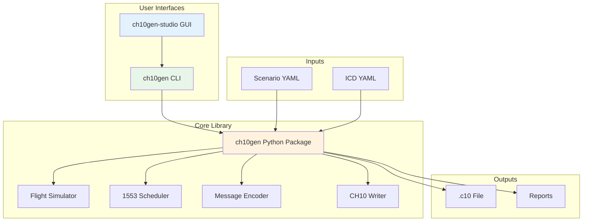

# CH10Gen - IRIG-106 Chapter 10 Generator

**Tool for generating IRIG-106 Chapter 10 files with MIL-STD-1553 flight test data**

[](https://www.python.org/downloads/)
[](https://www.microsoft.com/windows)
[](https://opensource.org/licenses/MIT)

## Overview

**CH10Gen** is a tool that generates IRIG-106 Chapter 10 files containing realistic MIL-STD-1553 bus traffic derived from simulated flight profiles. It consists of two components:

- **ch10gen**: Command-line tool and Python library for CH10 generation
- **ch10gen-studio**: Desktop GUI application for visual editing and generation

### Use Cases

- Testing CH10 readers without expensive flight test equipment
- Developing 1553 data analysis tools with realistic data patterns
- Training and education on aerospace data formats
- System integration testing with predictable, repeatable data

## Quick Start

```bash
# Install from source
git clone https://github.com/yourusername/ch10-1553-flightgen.git
cd ch10-1553-flightgen
pip install -e .

# Generate your first CH10 file with flight data
ch10gen build --scenario scenarios/example.yaml --icd icd/nav_icd.yaml --out demo.c10

# Generate with random test data
ch10gen build --scenario scenarios/test_large.yaml --icd icd/test/test_large.yaml --out test.c10

# Validate the output
ch10gen validate demo.c10
```

## Architecture

The system follows a modular architecture with separation between the core library and user interfaces:



## Key Features

### Scenario-Driven Data Generation (NEW!)
- **13+ Data Generator Types**: constant, increment, pattern, random distributions, waveforms, expressions
- **Mathematical Expressions**: Reference and calculate values from other fields
- **Waveform Generation**: sine, cosine, square, sawtooth, ramp waves
- **Random Distributions**: uniform, normal, multimodal with configurable parameters
- **Field References**: Same word, same message, or cross-message references
- **High Performance**: Tested with 1000+ messages/second and 70k+ line ICDs

### Flight Profile Simulation
- **Parametric flight segments**: climb, cruise, turn, descent, touch-and-go
- **Physics-based kinematics** with ISA atmosphere modeling
- **Waypoint navigation** with speed/altitude constraints
- **Smooth state transitions** using coordinated turns and realistic dynamics
- **Output signals**: position (lat/lon/alt), velocities (IAS/TAS/Mach), attitudes (roll/pitch/yaw), rates, accelerations

### 1553 Bus Simulation
- **BC/RT scheduling** with major/minor frames (e.g., 1s major, 20ms minor)
- **Multiple encoding formats**:
  - BNR (Binary Natural) - 16-bit signed
  - BCD (Binary Coded Decimal)
  - U16/I16 (Unsigned/Signed integers)
  - Float32 split across two words
- **Error injection capabilities**:
  - Parity errors
  - Late responses
  - No response conditions
  - Timing jitter (±ms)
- **Bus utilization** tracking and statistics

### ICD-Driven Configuration
- **YAML-based** message and word definitions
- **Flexible signal mapping** from flight data to 1553 words
- **Automatic scaling** with configurable scale/offset
- **Range validation** with min/max bounds checking
- **Source abstraction** - map any flight parameter to any word

### Chapter 10 Compliance
- **TMATS Generation** (0x01) - Complete metadata description
- **Time Packets** (0x11 F1) - Synchronized time references
- **1553 Format 1** (0x19) - Proper CSDW, TTB, IPTS fields
- **Configurable packetization** - Optimize for size or message count
- **Channel management** - Proper IDs for time, TMATS, bus channels

### Command Line Interface
```bash
# Build CH10 file
ch10gen build --scenario flight.yaml --icd messages.yaml --out output.c10

# Validate output
ch10gen validate output.c10

# Check ICD syntax
ch10gen check-icd messages.yaml

# Export to other formats
ch10gen export output.c10 --format csv
```

## Components

### ch10gen - Core Tool
The main command-line interface and Python library:
- **Purpose**: Generate, validate, and export CH10 files
- **Interface**: Command-line (`ch10gen` command)
- **Language**: Python 3.10+
- **Distribution**: Python package or standalone executable

### ch10gen-studio - GUI Application
Desktop application for visual editing:
- **Purpose**: Visual interface for ch10gen with real-time feedback
- **Technology**: Tauri (Rust) + React + TypeScript
- **Platform**: Windows 10/11
- **Distribution**: Portable executable or installer

## Installation

### Prerequisites
- Python 3.10 or higher
- Windows 10/11 (primary platform)
- Git Bash (recommended terminal)

### Install from Source
```bash
# Clone the repository
git clone https://github.com/yourusername/ch10-1553-flightgen.git
cd ch10-1553-flightgen

# Install in development mode
pip install -e .

# Or install dependencies directly
pip install -r requirements.txt
```

### Build Standalone Executable
```bash
# Build ch10gen CLI executable
pyinstaller --onefile ch10gen/__main__.py

# Output: dist/ch10gen.exe
```

### Build GUI Application
```bash
# Build ch10gen-studio
cd ch10gen-studio
npm install
npm run tauri build

# Output: portable executable or installer
```

## Usage Examples

### Basic Generation
```bash
# Generate a 10-minute flight with default settings
ch10gen build \
    --scenario scenarios/demo_flight.yaml \
    --icd icd/navigation.yaml \
    --out flight_test.c10 \
    --duration 600
```

### Advanced Options
```bash
# Generate with error injection and custom seed
ch10gen build \
    --scenario scenarios/combat_mission.yaml \
    --icd icd/full_avionics.yaml \
    --out mission.c10 \
    --duration 3600 \
    --seed 42 \
    --err.parity 0.1 \
    --err.late 0.05 \
    --jitter-ms 2 \
    --packet-bytes 65536
```

### Validation
```bash
# Validate CH10 file structure
ch10gen validate flight_test.c10

# Check ICD for errors
ch10gen check-icd icd/navigation.yaml

# Dry run to preview without writing
ch10gen build --dry-run --verbose \
    --scenario scenarios/test.yaml \
    --icd icd/test.yaml
```

## Configuration Examples

### Scenario YAML
```yaml
# scenarios/fighter_demo.yaml
name: "Fighter Aircraft Demo"
start_time_utc: "2025-01-15T14:00:00Z"
duration_s: 600
seed: 42

profile:
  base_altitude_ft: 5000
  segments:
    - type: takeoff
      duration_s: 30
      climb_rate_fpm: 3000
      
    - type: climb
      to_altitude_ft: 25000
      ias_kt: 350
      duration_s: 180
      
    - type: combat_turn
      bank_deg: 60
      g_force: 4.0
      heading_change_deg: 180
      duration_s: 45
      
    - type: cruise
      altitude_ft: 25000
      mach: 0.8
      duration_s: 240
      
    - type: descent
      to_altitude_ft: 5000
      vs_fpm: -2000
      duration_s: 105

errors:
  parity_percent: 0.05
  late_percent: 0.02
  jitter_ms: 1.5
```

### ICD YAML
```yaml
# icd/navigation.yaml
bus: A
messages:
  - name: NAV_DATA_50HZ
    rate_hz: 50
    rt: 10        # Remote Terminal address
    tr: BC2RT     # Transfer type
    sa: 1         # Subaddress
    wc: 16        # Word count
    words:
      - name: altitude_ft
        src: flight.altitude_ft
        encode: bnr16
        scale: 1.0
        min: -1000
        max: 60000
        
      - name: airspeed_kts
        src: flight.airspeed_kts
        encode: u16
        scale: 1.0
        
      - name: heading_deg
        src: flight.heading_deg
        encode: bnr16
        scale: 1.0
        
      - name: roll_deg
        src: flight.roll_deg
        encode: bnr16
        scale: 0.1    # 0.1 degree resolution
        
      - name: pitch_deg
        src: flight.pitch_deg
        encode: bnr16
        scale: 0.1
        
      - name: latitude
        src: flight.lat_deg
        encode: float32_split
        word_order: lsw_msw
        
      - name: longitude
        src: flight.lon_deg
        encode: float32_split
        word_order: lsw_msw
        
      # Remaining words...
      - name: status
        src: derived.status
        encode: u16
```

## Testing

Run the test suite to verify functionality:

```bash
# Run all tests
pytest tests/

# Run with coverage report
pytest --cov=ch10gen tests/ --cov-report=html

# Run specific test suite
pytest tests/test_icd.py -v

# Run integration tests
pytest tests/test_integration_spec.py

# Quick validation
python scripts/run_all_tests.py
```

### Test Coverage
- **Unit Tests**: Core modules (ICD, encoding, scheduling)
- **Integration Tests**: End-to-end CH10 generation
- **Validation Tests**: Spec compliance verification
- **Performance Tests**: Large file generation

## Performance

| Metric | Value |
|--------|-------|
| Generation Speed | ~100,000 messages/sec |
| File Size | ~10 MB/minute @ 50Hz |
| Memory Usage | < 100 MB |
| Supported Duration | Hours to days |
| Max Message Rate | 1000 Hz |
| Bus Utilization | Up to 100% |

## Documentation

For documentation, see the following guides:

| Document | Description |
|----------|-------------|
| [Documentation Index](docs/INDEX.md) | Complete documentation overview |
| [Quick Start Guide](docs/QUICK_START.md) | Get running in 5 minutes |
| [Configuration](docs/CONFIGURATION.md) | YAML schemas and options |
| [API Reference](docs/API.md) | Complete API documentation |
| [Architecture](docs/ARCHITECTURE.md) | System design and components |
| [Testing Guide](docs/TESTING.md) | Running and writing tests |
| [Build Guide](docs/BUILD.md) | Building the application |
| [Troubleshooting](docs/TROUBLESHOOTING.md) | Common issues and solutions |
| [TShark Validation](docs/TSHARK_VALIDATION.md) | External validation with Wireshark |
| [Dependencies](docs/DEPENDENCIES_AND_TOOLS.md) | External tools and libraries |

## License

MIT License - see [LICENSE](LICENSE) for details.

## Acknowledgments

- **PyChapter10** - Core CH10 file handling library
- **IRIG-106 Standard** - Reference implementation
- **MIL-STD-1553** - Bus protocol specification
- **Tauri** - Cross-platform GUI framework


## Quick Links

- [PyChapter10 Documentation](https://pychapter10.readthedocs.io/)
- [IRIG-106 Standard](https://www.irig106.org/)
- [MIL-STD-1553 Tutorial](https://www.milstd1553.com/)
- [CH10 Tools](https://github.com/atac/c10-tools)

---

**CH10Gen** - IRIG-106 Chapter 10 generation for aerospace testing