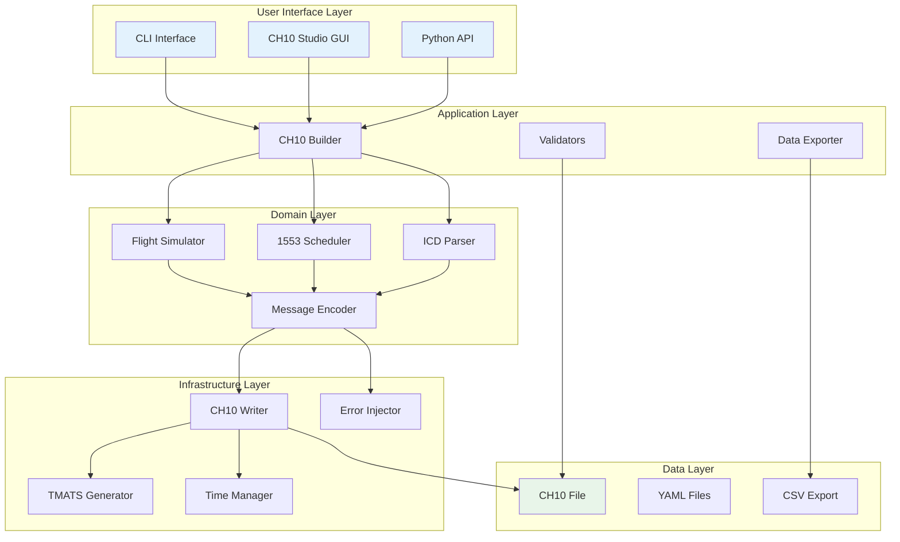
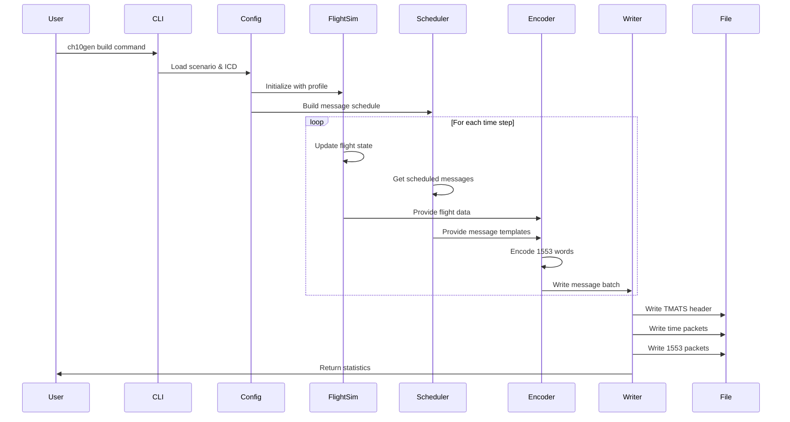
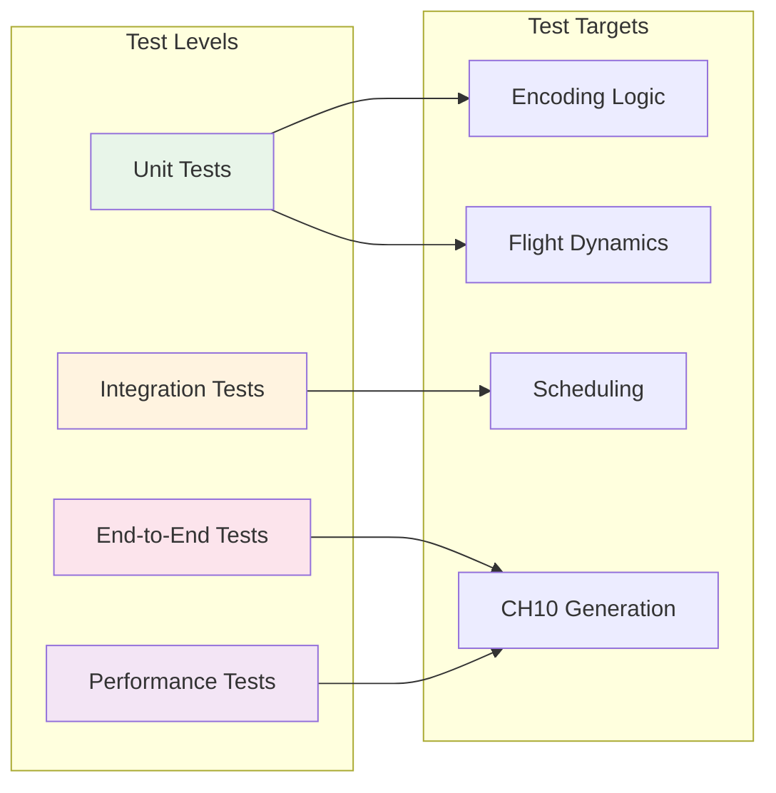
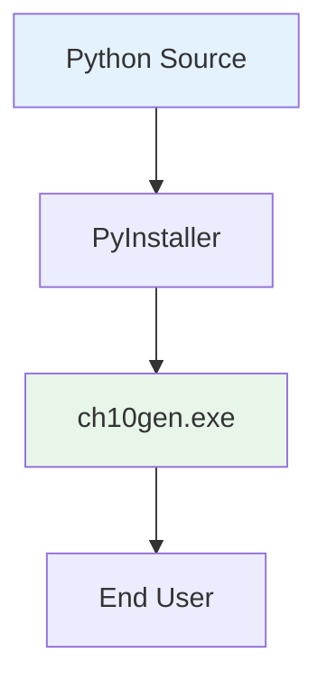
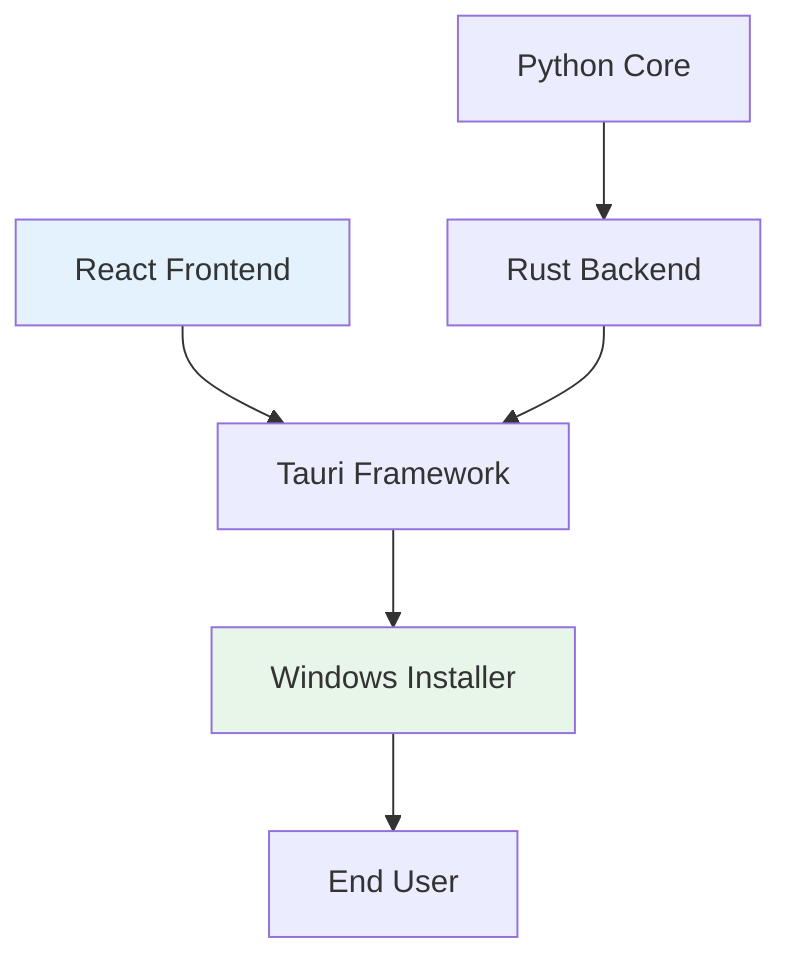

# System Architecture

## Overview

CH10-1553-FlightGen follows a **modular, layered architecture** designed for maintainability, testability, and extensibility. The system transforms high-level flight scenarios into spec-compliant IRIG-106 Chapter 10 files containing realistic MIL-STD-1553 bus traffic.

## High-Level Architecture



## Data Flow Pipeline



## Component Architecture

### Core Components

#### 1. Flight Simulator (`flight_profile.py`)
```python
class FlightProfile:
    """Generates realistic flight dynamics"""
    
    def __init__(self, seed: Optional[int] = None):
        self.segments: List[FlightSegment] = []
        self.current_state: FlightState = FlightState()
    
    def add_segment(self, segment: FlightSegment):
        """Add a flight segment (climb, cruise, turn, etc.)"""
    
    def get_state_at_time(self, time_s: float) -> FlightState:
        """Get interpolated flight state at specific time"""
```

**Responsibilities:**
- Physics-based flight dynamics
- ISA atmosphere modeling
- Smooth state transitions
- Waypoint navigation

#### 2. 1553 Scheduler (`schedule.py`)
```python
class BusSchedule:
    """Manages 1553 message scheduling"""
    
    def __init__(self):
        self.major_frame_time: float = 1.0
        self.minor_frames: List[MinorFrame] = []
        self.messages: List[ScheduledMessage] = []
    
    def add_message(self, message: MessageDefinition):
        """Add message to schedule based on rate"""
    
    def get_messages_at_time(self, time_s: float) -> List[ScheduledMessage]:
        """Get messages scheduled for specific time"""
```

**Responsibilities:**
- Major/minor frame management
- Message rate scheduling
- Bus utilization tracking
- Timing jitter injection

#### 3. Message Encoder (`core/encode1553.py`)
```python
def encode_message(
    message_def: MessageDefinition,
    flight_state: FlightState,
    error_config: Optional[ErrorConfig] = None
) -> EncodedMessage:
    """Encode flight data into 1553 message words"""
    
    # Build command word
    cmd_word = build_command_word(
        rt=message_def.rt,
        tr=message_def.tr,
        sa=message_def.sa,
        wc=message_def.wc
    )
    
    # Encode data words
    data_words = []
    for word_def in message_def.words:
        value = get_value_from_source(word_def.src, flight_state)
        encoded = encode_word(value, word_def.encode, word_def.scale)
        data_words.append(encoded)
    
    # Apply errors if configured
    if error_config:
        apply_errors(data_words, error_config)
    
    return EncodedMessage(cmd_word, data_words)
```

**Responsibilities:**
- Word encoding (BNR, BCD, U16, Float32)
- Scaling and offset application
- Range validation
- Error injection

#### 4. CH10 Writer (`ch10_writer.py`)
```python
class Ch10Writer:
    """Writes IRIG-106 Chapter 10 files"""
    
    def write_file(
        self,
        filepath: Path,
        schedule: BusSchedule,
        flight_profile: FlightProfile,
        icd: ICDDefinition
    ) -> WriterStatistics:
        """Write complete CH10 file"""
        
        # Write TMATS
        self.write_tmats_packet()
        
        # Write initial time packet
        self.write_time_packet()
        
        # Process messages in time order
        for batch in self.get_message_batches():
            self.write_1553_packet(batch)
            
        return self.get_statistics()
```

**Responsibilities:**
- TMATS generation
- Time packet synchronization
- 1553 F1 packet formatting
- Packet batching and optimization

## Design Patterns

### 1. **Builder Pattern**
Used for constructing complex CH10 files step by step:
```python
builder = Ch10Builder()
builder.with_scenario(scenario)
builder.with_icd(icd)
builder.with_error_config(errors)
ch10_file = builder.build()
```

### 2. **Strategy Pattern**
For different encoding strategies:
```python
encoders = {
    'bnr16': BNR16Encoder(),
    'bcd': BCDEncoder(),
    'float32_split': Float32SplitEncoder()
}
encoded = encoders[encoding_type].encode(value, params)
```

### 3. **Observer Pattern**
For progress reporting during generation:
```python
class ProgressObserver:
    def on_progress(self, percent: float, message: str):
        print(f"[{percent:3.0f}%] {message}")

writer.add_observer(ProgressObserver())
```

### 4. **Factory Pattern**
For creating different writer backends:
```python
def create_writer(backend: str) -> WriterBackend:
    if backend == 'irig106':
        return Irig106Writer()
    elif backend == 'pyc10':
        return PyC10Writer()
    else:
        raise ValueError(f"Unknown backend: {backend}")
```

## Extension Points

### Adding New Flight Segments
```python
class CustomSegment(FlightSegment):
    def update_state(self, state: FlightState, dt: float) -> FlightState:
        # Custom flight dynamics
        return updated_state

profile.add_segment(CustomSegment())
```

### Adding New Encodings
```python
@register_encoder('custom')
class CustomEncoder(WordEncoder):
    def encode(self, value: float, params: Dict) -> int:
        # Custom encoding logic
        return encoded_value
```

### Adding New Error Types
```python
class CustomError(ErrorInjector):
    def inject(self, message: EncodedMessage) -> EncodedMessage:
        # Custom error injection
        return modified_message
```

## Module Structure

```
ch10gen/
├── __main__.py          # CLI entry point
├── __init__.py          # Package exports
│
├── domain/              # Business logic
│   ├── flight_profile.py
│   ├── schedule.py
│   ├── icd.py
│   └── validation.py
│
├── core/                # Core functionality
│   ├── encode1553.py
│   ├── tmats.py
│   └── channel_config.py
│
├── infrastructure/      # External interfaces
│   ├── ch10_writer.py
│   ├── writer_backend.py
│   └── export.py
│
├── utils/              # Utilities
│   ├── errors.py
│   ├── util_time.py
│   └── constants.py
│
└── cli/                # CLI commands
    ├── build.py
    ├── validate.py
    └── export.py
```

## Security Considerations

1. **Input Validation**: All YAML inputs are validated against schemas
2. **Resource Limits**: Memory and file size limits enforced
3. **Safe Defaults**: Conservative defaults for all parameters
4. **Error Handling**: Graceful degradation on errors

## Performance Optimizations

### 1. **Batch Processing**
Messages are batched to minimize I/O operations:
```python
BATCH_SIZE = 1000
for batch in chunks(messages, BATCH_SIZE):
    write_batch(batch)
```

### 2. **Memory Streaming**
Large files use streaming to avoid memory issues:
```python
with Ch10StreamWriter(filepath) as writer:
    for chunk in generate_chunks():
        writer.write_chunk(chunk)
```

### 3. **Lazy Evaluation**
Flight states computed only when needed:
```python
@lru_cache(maxsize=1000)
def get_flight_state(time_s: float) -> FlightState:
    return profile.compute_state(time_s)
```

### 4. **Parallel Processing**
Multiple messages encoded in parallel:
```python
from concurrent.futures import ThreadPoolExecutor

with ThreadPoolExecutor() as executor:
    encoded = executor.map(encode_message, messages)
```

## Testing Architecture



## Deployment Architecture

### Standalone Executable


### GUI Application (CH10 Studio)


---

For more details on specific components, see:
- [Configuration Guide](CONFIGURATION.md)
- [Operations Manual](OPERATIONS.md)
- [API Reference](API_REFERENCE.md)