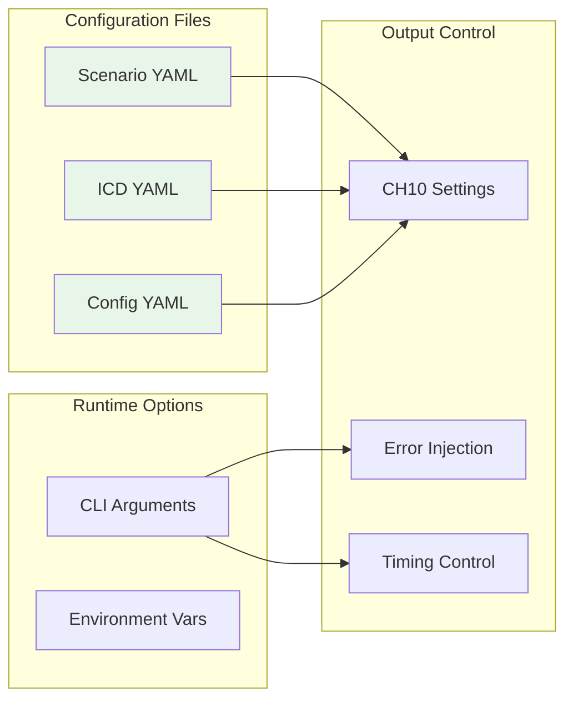
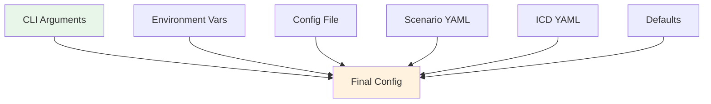

# Configuration Guide

This guide covers all configuration options for CH10-1553-FlightGen, including scenario definitions, ICD specifications, and runtime parameters.

## Configuration Overview



## Scenario Configuration

The scenario YAML file defines the flight profile and simulation parameters.

### Basic Structure
```yaml
# scenarios/basic_flight.yaml
name: "Basic Training Flight"
description: "Simple climb, cruise, and descent profile"
version: "1.0"
metadata:
  author: "Flight Test Team"
  date: "2025-01-15"
  
# Timing
start_time_utc: "2025-01-15T14:00:00Z"
duration_s: 1800  # 30 minutes
seed: 42  # For reproducibility

# Flight profile
profile:
  base_altitude_ft: 2000
  base_latitude_deg: 37.7749
  base_longitude_deg: -122.4194
  
  segments:
    - type: climb
      to_altitude_ft: 15000
      ias_kt: 250
      duration_s: 300
      
    - type: cruise
      altitude_ft: 15000
      mach: 0.5
      duration_s: 900
      
    - type: descent
      to_altitude_ft: 2000
      vs_fpm: -1500
      duration_s: 600

# Error injection (optional)
errors:
  parity_percent: 0.05
  late_percent: 0.02
  no_response_percent: 0.01
  jitter_ms: 2.0

# Bus configuration (optional)
bus:
  packet_bytes_target: 65536
  time_packet_interval_s: 1.0
```

### Flight Segment Types

#### 1. **Takeoff Segment**
```yaml
- type: takeoff
  duration_s: 30
  climb_rate_fpm: 3000
  acceleration_kts_per_s: 5
  rotation_speed_kts: 140
```

#### 2. **Climb Segment**
```yaml
- type: climb
  to_altitude_ft: 25000
  ias_kt: 280  # Indicated airspeed
  climb_rate_fpm: 2000
  duration_s: 480
```

#### 3. **Cruise Segment**
```yaml
- type: cruise
  altitude_ft: 35000
  mach: 0.82  # Or use ias_kt/tas_kt
  duration_s: 3600
  heading_deg: 090  # Optional
```

#### 4. **Turn Segment**
```yaml
- type: turn
  heading_change_deg: 180
  bank_deg: 30
  maintain_altitude: true
  ias_kt: 250
  duration_s: 60
```

#### 5. **Combat Turn**
```yaml
- type: combat_turn
  bank_deg: 60
  g_force: 4.0
  heading_change_deg: 270
  altitude_loss_ft: 2000
  duration_s: 45
```

#### 6. **Descent Segment**
```yaml
- type: descent
  to_altitude_ft: 3000
  vs_fpm: -1800  # Vertical speed
  ias_kt: 250
  duration_s: 420
```

#### 7. **Approach Segment**
```yaml
- type: approach
  runway_altitude_ft: 500
  glide_slope_deg: 3.0
  final_approach_speed_kts: 135
  duration_s: 180
```

#### 8. **Landing Segment**
```yaml
- type: landing
  touchdown_speed_kts: 125
  deceleration_kts_per_s: 5
  duration_s: 30
```

### Advanced Profile Features

#### Waypoint Navigation
```yaml
profile:
  waypoints:
    - name: "ALPHA"
      lat_deg: 37.7749
      lon_deg: -122.4194
      altitude_ft: 10000
      speed_kts: 250
      
    - name: "BRAVO"
      lat_deg: 37.8849
      lon_deg: -122.3094
      altitude_ft: 15000
      speed_kts: 300
      
  segments:
    - type: waypoint_nav
      from: "ALPHA"
      to: "BRAVO"
      cruise_speed_kts: 280
```

#### Holding Pattern
```yaml
- type: holding
  center_lat_deg: 37.7749
  center_lon_deg: -122.4194
  altitude_ft: 10000
  pattern: "racetrack"  # or "circular"
  leg_length_nm: 5
  turn_direction: "right"
  speed_kts: 180
  duration_s: 600
```

## ICD Configuration

The ICD (Interface Control Document) YAML defines the 1553 message structure and data encoding.

### Basic Structure
```yaml
# icd/avionics.yaml
name: "Avionics Bus ICD"
version: "2.0"
description: "Complete avionics bus definition"

# Bus configuration
bus: A  # or B
default_gap_us: 4  # Inter-message gap

# Message definitions
messages:
  - name: "NAV_DATA_50HZ"
    description: "Navigation data at 50Hz"
    rate_hz: 50
    rt: 10  # Remote Terminal address (0-31)
    tr: BC2RT  # Transfer type: BC2RT, RT2BC, RT2RT
    sa: 1  # Subaddress (0-31)
    wc: 16  # Word count (1-32)
    
    words:
      # Word definitions (see below)
```

### Word Definition Structure
```yaml
words:
  - name: "altitude_ft"
    description: "Barometric altitude"
    src: "flight.altitude_ft"  # Source data path
    encode: "bnr16"  # Encoding type
    scale: 1.0  # Scale factor
    offset: 0.0  # Offset
    min_value: -1000  # Minimum valid value
    max_value: 60000  # Maximum valid value
    units: "feet"
    
  - name: "airspeed_kts"
    src: "flight.airspeed_kts"
    encode: "u16"
    scale: 0.1  # 0.1 knot resolution
    min_value: 0
    max_value: 600
```

### Encoding Types

#### **BNR (Binary Natural) - 16-bit signed**
```yaml
- name: "pitch_angle"
  src: "flight.pitch_deg"
  encode: "bnr16"
  scale: 0.01  # 0.01 degree resolution
  min_value: -90
  max_value: 90
```

#### **BCD (Binary Coded Decimal)**
```yaml
- name: "altitude_bcd"
  src: "flight.altitude_ft"
  encode: "bcd"
  digits: 5  # Number of BCD digits
```

#### **U16/I16 (Unsigned/Signed 16-bit)**
```yaml
- name: "engine_rpm"
  src: "engine.rpm"
  encode: "u16"
  scale: 1.0
  max_value: 65535

- name: "temperature"
  src: "sensors.temp_c"
  encode: "i16"
  scale: 0.1
  offset: -273.15  # Convert to Kelvin
```

#### **Float32 Split (IEEE 754 across 2 words)**
```yaml
- name: "latitude_precise"
  src: "flight.lat_deg"
  encode: "float32_split"
  word_order: "lsw_msw"  # or "msw_lsw"
  # Uses 2 consecutive words
```

#### **Bitfield Packing (Multiple fields per word)**
```yaml
- name: "system_ok"
  encode: "u16"
  src: "flight.system_ok"
  mask: 0x01        # 1 bit
  shift: 0          # Start at bit 0
  word_index: 0     # Pack into word 0
  
- name: "warning"
  encode: "u16" 
  src: "flight.warning"
  mask: 0x01        # 1 bit
  shift: 1          # Start at bit 1
  word_index: 0     # Pack into word 0
  
- name: "temperature"
  encode: "u16"
  src: "flight.temperature"
  scale: 0.5        # Scale factor
  offset: -40.0     # Offset value
  mask: 0x7F        # 7 bits (0-127)
  shift: 3          # Start at bit 3
  word_index: 0     # Pack into word 0
```

**Bitfield Rules:**
- **Mask**: Bit pattern (0x0000-0xFFFF) defining which bits to use
- **Shift**: Number of bits to shift left (0-15)
- **Word Index**: Which word this field belongs to (for multi-field words)
- **Validation**: Shift + mask bits must not exceed 16
- **Overlap Prevention**: Fields in the same word cannot overlap
- **BNR16 Restriction**: BNR16 encoding cannot use bitfields (full word only)
- **Float32 Restriction**: Float32_split cannot use bitfields

#### **Constant Values**
```yaml
- name: "config_word"
  encode: "u16"
  const: 0x1234  # Fixed value
  
- name: "reserved"
  encode: "u16"
  const: 0  # Padding
```

### Complex Message Examples

#### Navigation Message
```yaml
- name: "NAVIGATION"
  rate_hz: 50
  rt: 10
  tr: BC2RT
  sa: 1
  wc: 20
  words:
    # Position (6 words)
    - { name: "lat_deg", src: "flight.lat_deg", encode: "float32_split", word_order: "lsw_msw" }
    - { name: "lon_deg", src: "flight.lon_deg", encode: "float32_split", word_order: "lsw_msw" }
    - { name: "altitude_ft", src: "flight.altitude_ft", encode: "bnr16", scale: 1.0 }
    
    # Velocity (3 words)
    - { name: "ground_speed_kts", src: "flight.ground_speed_kts", encode: "u16", scale: 0.1 }
    - { name: "vertical_speed_fpm", src: "flight.vs_fpm", encode: "i16", scale: 1.0 }
    - { name: "mach", src: "flight.mach", encode: "u16", scale: 0.0001 }
    
    # Attitude (3 words)
    - { name: "roll_deg", src: "flight.roll_deg", encode: "bnr16", scale: 0.01 }
    - { name: "pitch_deg", src: "flight.pitch_deg", encode: "bnr16", scale: 0.01 }
    - { name: "heading_deg", src: "flight.heading_deg", encode: "u16", scale: 0.01 }
    
    # Status (2 words)
    - { name: "status_flags", src: "derived.nav_status", encode: "u16" }
    - { name: "time_tag", src: "derived.time_ms", encode: "u32", split: true }
    
    # Reserved (6 words)
    - { name: "reserved_1", encode: "u16", const: 0 }
    - { name: "reserved_2", encode: "u16", const: 0 }
    - { name: "reserved_3", encode: "u16", const: 0 }
    - { name: "reserved_4", encode: "u16", const: 0 }
    - { name: "reserved_5", encode: "u16", const: 0 }
    - { name: "reserved_6", encode: "u16", const: 0 }
```

#### Engine Data Message
```yaml
- name: "ENGINE_DATA"
  rate_hz: 20
  rt: 15
  tr: RT2BC
  sa: 5
  wc: 12
  words:
    - { name: "n1_percent", src: "engine.n1", encode: "u16", scale: 0.1, max_value: 110 }
    - { name: "n2_percent", src: "engine.n2", encode: "u16", scale: 0.1, max_value: 110 }
    - { name: "egt_celsius", src: "engine.egt", encode: "i16", scale: 1.0, max_value: 1000 }
    - { name: "fuel_flow_pph", src: "engine.fuel_flow", encode: "u16", scale: 1.0 }
    - { name: "oil_pressure_psi", src: "engine.oil_pressure", encode: "u16", scale: 0.1 }
    - { name: "oil_temp_c", src: "engine.oil_temp", encode: "i16", scale: 0.1 }
    - { name: "vibration_ips", src: "engine.vibration", encode: "u16", scale: 0.001 }
    - { name: "thrust_lbs", src: "engine.thrust", encode: "u16", scale: 10 }
    - { name: "status", src: "engine.status", encode: "u16" }
    - { name: "reserved_1", encode: "u16", const: 0 }
    - { name: "reserved_2", encode: "u16", const: 0 }
    - { name: "reserved_3", encode: "u16", const: 0 }
```

#### Status Message with Bitfield Packing
```yaml
- name: "SYSTEM_STATUS"
  rate_hz: 10
  rt: 5
  tr: RT2BC
  sa: 2
  wc: 2  # Only 2 words needed due to bitfield packing
  words:
    # Word 0: Packed status bits (16 bits total)
    - name: "system_ok"
      encode: "u16"
      src: "flight.system_ok"
      mask: 0x01
      shift: 0
      word_index: 0
      
    - name: "warning"
      encode: "u16"
      src: "flight.warning"
      mask: 0x01
      shift: 1
      word_index: 0
      
    - name: "error"
      encode: "u16"
      src: "flight.error"
      mask: 0x01
      shift: 2
      word_index: 0
      
    - name: "temperature"
      encode: "u16"
      src: "flight.temperature"
      scale: 0.5
      offset: -40.0
      mask: 0x7F
      shift: 3
      word_index: 0
      
    - name: "pressure"
      encode: "u16"
      src: "flight.pressure"
      scale: 10.0
      offset: 0.0
      mask: 0x3F
      shift: 10
      word_index: 0
      
    # Word 1: Engine parameters (16 bits total)
    - name: "rpm"
      encode: "u16"
      src: "flight.engine_rpm"
      scale: 10.0
      offset: 0.0
      mask: 0x7FF
      shift: 0
      word_index: 1
      
    - name: "oil_temp"
      encode: "u16"
      src: "flight.oil_temperature"
      scale: 1.0
      offset: 0.0
      mask: 0x0F
      shift: 11
      word_index: 1
      
    - name: "oil_pressure_high"
      encode: "u16"
      src: "flight.oil_pressure_high"
      mask: 0x01
      shift: 15
      word_index: 1
```

**Benefits of Bitfield Packing:**
- **Bandwidth Efficiency**: Pack multiple parameters into single words
- **Reduced Message Size**: Fewer words per message means higher message rates
- **Efficient Storage**: Optimize CH10 file size for long recordings
- **Real-time Performance**: Faster message processing with fewer words

## Runtime Configuration

### CLI Arguments
```bash
ch10gen build \
    --scenario scenarios/flight.yaml \
    --icd icd/bus.yaml \
    --out output.c10 \
    --duration 3600 \
    --seed 42 \
    --start "2025-01-15T14:00:00Z" \
    --rate-hz 100 \
    --packet-bytes 65536 \
    --err.parity 0.1 \
    --err.late 0.05 \
    --err.no-response 0.02 \
    --jitter-ms 2 \
    --writer irig106 \
    --verbose
```

### Configuration File
```yaml
# config.yaml
defaults:
  writer: "irig106"
  packet_bytes: 65536
  time_packet_interval_s: 1.0
  
channels:
  time:
    id: 0x100
    enabled: true
    
  tmats:
    id: 0x001
    enabled: true
    
  bus_a:
    id: 0x200
    enabled: true
    
  bus_b:
    id: 0x210
    enabled: false
    
output:
  compression: false
  include_index: true
  metadata:
    project: "Flight Test 2025"
```

### Environment Variables
```bash
# Override configuration via environment
export CH10GEN_WRITER=pyc10
export CH10GEN_PACKET_SIZE=32768
export CH10GEN_DEBUG=true
export CH10GEN_OUTPUT_DIR=/data/ch10
```

## Configuration Precedence

Configuration values are resolved in this order (highest to lowest priority):

1. **CLI arguments** - Direct command-line flags
2. **Environment variables** - CH10GEN_* variables
3. **Config file** - config.yaml if present
4. **Scenario file** - Values in scenario YAML
5. **ICD file** - Values in ICD YAML
6. **Defaults** - Built-in defaults



## Best Practices

### 1. **Use Descriptive Names**
```yaml
# Good
- name: "NAV_PRIMARY_50HZ"
  description: "Primary navigation data at 50Hz"

# Bad
- name: "MSG1"
```

### 2. **Document Units**
```yaml
- name: "altitude_ft"
  units: "feet"  # Always specify units
  scale: 1.0
```

### 3. **Set Realistic Ranges**
```yaml
- name: "airspeed_kts"
  min_value: 0
  max_value: 600  # Realistic for aircraft
```

### 4. **Use Seeds for Testing**
```yaml
seed: 42  # Reproducible output for testing
```

### 5. **Validate Early**
```bash
# Always validate before generation
ch10gen check-scenario scenarios/my_scenario.yaml
ch10gen check-icd icd/my_icd.yaml
```

## Troubleshooting

### Common Configuration Issues

#### Issue: "Invalid YAML syntax"
```yaml
# Wrong - missing quotes
name: Fighter's Mission

# Correct
name: "Fighter's Mission"
```

#### Issue: "Word count mismatch"
```yaml
# Ensure word count matches actual words
wc: 16  # Must match number of words defined
words:
  # ... exactly 16 word definitions
```

#### Issue: "Invalid encoding"
```yaml
# Check supported encodings
encode: "bnr16"  # Correct
encode: "binary"  # Wrong - not supported
```

#### Issue: "Rate too high"
```yaml
rate_hz: 50  # Good - realistic
rate_hz: 5000  # Bad - exceeds bus capacity
```

## Additional Resources

- [YAML Reference](YAML_REFERENCE.md) - Complete field reference
- [YAML Examples](YAML_EXAMPLES.md) - More configuration examples
- [Validation Guide](VALIDATION.md) - Configuration validation
- [Operations Manual](OPERATIONS.md) - Runtime options

---

For questions about configuration, see our [FAQ](FAQ.md) or [open an issue](https://github.com/yourusername/ch10-1553-flightgen/issues).