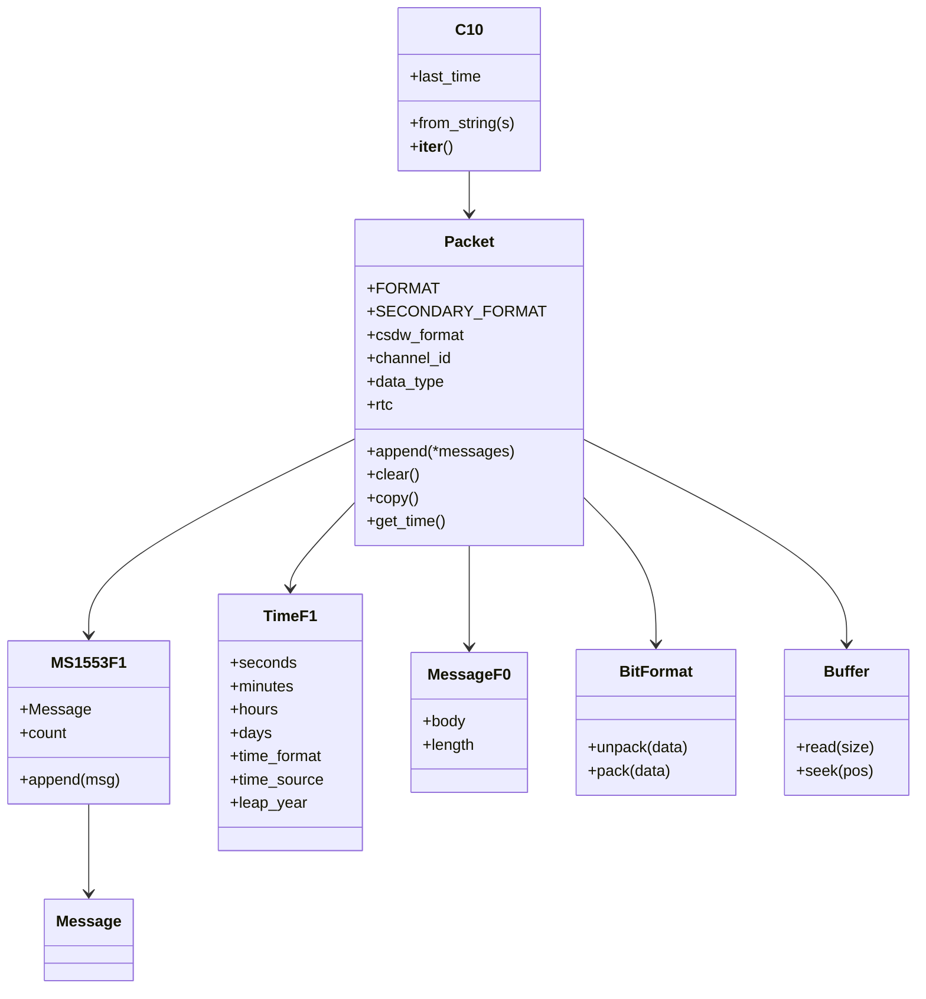
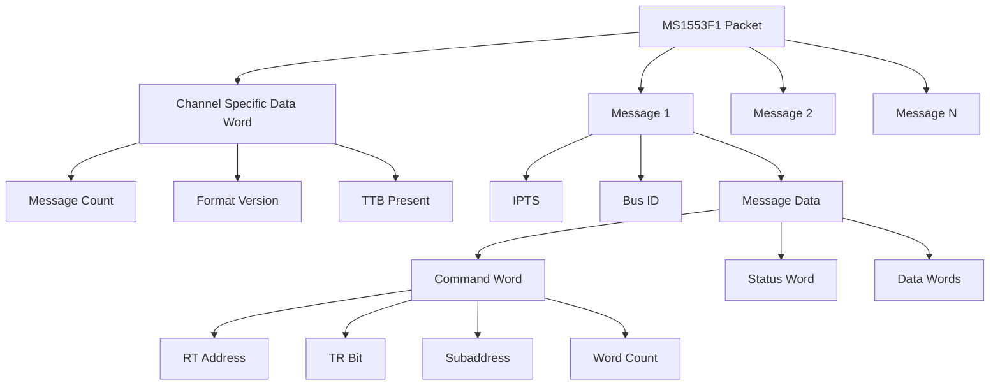

# PyChapter10 Comprehensive Documentation

## Table of Contents

1. [Overview](#overview)
2. [Installation and Setup](#installation-and-setup)
3. [Core Architecture](#core-architecture)
4. [Data Types and Formats](#data-types-and-formats)
5. [Reading Chapter 10 Files](#reading-chapter-10-files)
6. [Writing Chapter 10 Files](#writing-chapter-10-files)
7. [MIL-STD-1553 Integration](#mil-std-1553-integration)
8. [Time Data Handling](#time-data-handling)
9. [TMATS Support](#tmats-support)
10. [Error Handling and Validation](#error-handling-and-validation)
11. [Performance Considerations](#performance-considerations)
12. [Integration with ch10gen](#integration-with-ch10gen)
13. [Troubleshooting](#troubleshooting)
14. [API Reference](#api-reference)

## Overview

PyChapter10 is an open-source Python library designed for reading and writing IRIG 106 Chapter 10 (now Chapter 11) files. It provides a Pythonic interface to handle Chapter 10 data efficiently, making it the standard library for working with flight test data in Python environments.

### Key Features

- **IRIG-106 Compliant**: Full support for IRIG-106 Chapter 10/11 standards
- **MIL-STD-1553 Support**: Comprehensive handling of 1553 bus data
- **Time Data Formats**: Support for various time data formats including IRIG-B
- **TMATS Integration**: Built-in support for Test and Measurement Attributes
- **Cross-Platform**: Works on Windows, Linux, and macOS
- **Memory Efficient**: Streaming support for large files
- **Extensible**: Easy to add new data types and formats

### Use Cases

- Flight test data analysis
- MIL-STD-1553 bus monitoring
- Data recording and playback systems
- Test and measurement applications
- Aerospace data processing

## Installation and Setup

### Basic Installation

```bash
pip install pychapter10
```

### Verification

```python
try:
    from chapter10 import C10
    from chapter10.ms1553 import MS1553F1
    from chapter10.time import TimeF1
    from chapter10.message import MessageF0
    print("PyChapter10 successfully installed")
except ImportError as e:
    print(f"PyChapter10 installation failed: {e}")
```

### Dependencies

PyChapter10 requires:
- Python 3.7+
- `bitstruct` for binary data handling
- `struct` for low-level data manipulation

## Core Architecture

### Class Hierarchy



### Core Components

#### C10 Class
The main interface for Chapter 10 file operations:

```python
from chapter10 import C10

# Initialize from file
c10 = C10('flight_data.c10')

# Initialize from file-like object
with open('data.c10', 'rb') as f:
    c10 = C10(f)

# Iterate over packets
for packet in c10:
    print(f"Packet type: {type(packet).__name__}")
    print(f"Channel ID: 0x{packet.channel_id:03X}")
    print(f"Data type: 0x{packet.data_type:02X}")
```

#### Packet Base Class
All Chapter 10 packets inherit from the base Packet class:

```python
class CustomPacket(Packet):
    FORMAT = BitFormat('''
        u16 sync
        u16 channel_id
        u32 packet_length
        u32 data_length
        u8 version
        u8 sequence
        u8 data_type
        u8 reserved
        u16 checksum
        u32 rtc_low
        u16 rtc_high
    ''')
    
    csdw_format = BitFormat('''
        u16 message_count
        p9
        u3 ttb
        u4 format
    ''')
```

## Data Types and Formats

### Supported Data Types

| Data Type | Code | Description | Class |
|-----------|------|-------------|-------|
| TMATS | 0x01 | Test and Measurement Attributes | MessageF0 |
| Time Data F1 | 0x11 | Time Data Format 1 | TimeF1 |
| MS1553 F1 | 0x19 | MIL-STD-1553 Format 1 | MS1553F1 |
| Computer F1 | 0x01 | Computer Generated Data | MessageF0 |
| Ethernet F0 | 0x20 | Ethernet Data | EthernetF0 |

### BitFormat Usage

PyChapter10 uses the BitFormat class for defining data structures:

```python
from chapter10.util import BitFormat

# Define a custom format
format = BitFormat('''
    u16 sync_word
    u16 channel_id
    u32 packet_length
    u32 data_length
    u8 version
    u8 sequence
    u8 data_type
    u8 reserved
    u16 checksum
    u32 rtc_low
    u16 rtc_high
''')

# Pack data
data = format.pack({
    'sync_word': 0xEB25,
    'channel_id': 0x0200,
    'packet_length': 100,
    'data_length': 80,
    'version': 0,
    'sequence': 1,
    'data_type': 0x19,
    'reserved': 0,
    'checksum': 0,
    'rtc_low': 0x12345678,
    'rtc_high': 0x9ABC
})

# Unpack data
values = format.unpack(data)
```

## Reading Chapter 10 Files

### Basic File Reading

```python
from chapter10 import C10
from chapter10.ms1553 import MS1553F1
from chapter10.time import TimeF1
from chapter10.message import MessageF0

def read_ch10_file(filepath):
    """Read and analyze a Chapter 10 file."""
    c10 = C10(filepath)
    
    packet_stats = {
        'total_packets': 0,
        'ms1553_packets': 0,
        'time_packets': 0,
        'tmats_packets': 0,
        'channels': set(),
        'time_range': None
    }
    
    first_time = None
    last_time = None
    
    for packet in c10:
        packet_stats['total_packets'] += 1
        packet_stats['channels'].add(packet.channel_id)
        
        # Track time range
        if hasattr(packet, 'rtc') and packet.rtc:
            if first_time is None or packet.rtc < first_time:
                first_time = packet.rtc
            if last_time is None or packet.rtc > last_time:
                last_time = packet.rtc
        
        # Count packet types
        if isinstance(packet, MS1553F1):
            packet_stats['ms1553_packets'] += 1
        elif isinstance(packet, TimeF1):
            packet_stats['time_packets'] += 1
        elif isinstance(packet, MessageF0):
            packet_stats['tmats_packets'] += 1
    
    if first_time and last_time:
        packet_stats['time_range'] = {
            'start': first_time,
            'end': last_time,
            'duration_us': last_time - first_time
        }
    
    return packet_stats
```

### MIL-STD-1553 Message Reading

```python
def read_1553_messages(filepath, max_messages=1000):
    """Read MIL-STD-1553 messages from Chapter 10 file."""
    c10 = C10(filepath)
    message_count = 0
    
    for packet in c10:
        if not isinstance(packet, MS1553F1):
            continue
            
        for message in packet:
            if message_count >= max_messages:
                return
                
            # Extract message data
            if len(message.data) >= 4:
                # Parse command word (first 2 bytes)
                cmd_word = struct.unpack('<H', message.data[0:2])[0]
                rt = (cmd_word >> 11) & 0x1F
                tr = (cmd_word >> 10) & 0x01
                sa = (cmd_word >> 5) & 0x1F
                wc = cmd_word & 0x1F
                if wc == 0:
                    wc = 32
                
                # Parse status word (next 2 bytes)
                status_word = struct.unpack('<H', message.data[2:4])[0]
                
                yield {
                    'ipts': message.ipts,
                    'bus': message.bus,
                    'rt': rt,
                    'sa': sa,
                    'tr': 'RT2BC' if tr else 'BC2RT',
                    'wc': wc,
                    'status': status_word,
                    'data': message.data[4:]  # Data words
                }
                
                message_count += 1
```

### Time Data Reading

```python
def read_time_data(filepath):
    """Read time data from Chapter 10 file."""
    c10 = C10(filepath)
    
    for packet in c10:
        if isinstance(packet, TimeF1):
            yield {
                'rtc': packet.rtc,
                'seconds': packet.seconds,
                'minutes': packet.minutes,
                'hours': packet.hours,
                'days': packet.days,
                'time_format': packet.time_format,
                'time_source': packet.time_source,
                'leap_year': packet.leap_year
            }
```

## Writing Chapter 10 Files

### Basic File Writing

```python
from chapter10 import C10
from chapter10.ms1553 import MS1553F1
from chapter10.time import TimeF1
from chapter10.message import MessageF0
from datetime import datetime

def write_ch10_file(output_path, messages, time_packets, tmats_content):
    """Write a complete Chapter 10 file."""
    
    with open(output_path, 'wb') as f:
        # Write TMATS packet first
        tmats_packet = MessageF0()
        tmats_packet.channel_id = 0x000  # TMATS on channel 0
        tmats_packet.data_type = 0x01
        tmats_packet.rtc = 0
        tmats_packet.body = tmats_content.encode('utf-8')
        f.write(bytes(tmats_packet))
        
        # Write time packets
        for time_data in time_packets:
            time_packet = TimeF1()
            time_packet.channel_id = 0x001
            time_packet.data_type = 0x11
            time_packet.rtc = time_data['rtc']
            time_packet.seconds = time_data['seconds']
            time_packet.minutes = time_data['minutes']
            time_packet.hours = time_data['hours']
            time_packet.days = time_data['days']
            time_packet.time_format = 0  # IRIG-B
            time_packet.time_source = 1  # External
            time_packet.leap_year = time_data['leap_year']
            f.write(bytes(time_packet))
        
        # Write 1553 packets
        for msg_group in messages:
            packet = MS1553F1()
            packet.channel_id = 0x002  # 1553 Bus A
            packet.data_type = 0x19
            packet.rtc = msg_group['rtc']
            
            for msg_data in msg_group['messages']:
                msg = packet.Message()
                msg.ipts = msg_data['ipts']
                msg.bus = msg_data['bus']
                msg.data = msg_data['data']
                packet.append(msg)
            
            # Set message count
            packet.count = len(msg_group['messages'])
            f.write(bytes(packet))
```

### MIL-STD-1553 Message Writing

```python
def create_1553_message(rt, sa, wc, tr=0, data_words=None):
    """Create a MIL-STD-1553 message."""
    import struct
    
    # Build command word
    cmd_word = (rt << 11) | (tr << 10) | (sa << 5) | (wc & 0x1F)
    
    # Build status word (simplified)
    status_word = 0x8000  # Terminal flag set
    
    # Build message data
    msg_data = struct.pack('<HH', cmd_word, status_word)
    
    # Add data words if provided
    if data_words:
        for word in data_words:
            msg_data += struct.pack('<H', word)
    
    return msg_data

def write_1553_packet(messages, channel_id=0x002, rtc=0):
    """Write a 1553 packet with multiple messages."""
    packet = MS1553F1()
    packet.channel_id = channel_id
    packet.data_type = 0x19
    packet.rtc = rtc
    
    for msg_data in messages:
        msg = packet.Message()
        msg.ipts = msg_data['ipts']
        msg.bus = msg_data['bus']
        msg.data = msg_data['data']
        packet.append(msg)
    
    # Set message count
    packet.count = len(messages)
    
    return bytes(packet)
```

## MIL-STD-1553 Integration

### Message Structure

MIL-STD-1553 messages in PyChapter10 follow this structure:



### Command Word Parsing

```python
def parse_command_word(cmd_word):
    """Parse MIL-STD-1553 command word."""
    rt = (cmd_word >> 11) & 0x1F      # RT address (5 bits)
    tr = (cmd_word >> 10) & 0x01      # TR bit (1 bit)
    sa = (cmd_word >> 5) & 0x1F       # Subaddress (5 bits)
    wc = cmd_word & 0x1F              # Word count (5 bits)
    
    if wc == 0:
        wc = 32  # Word count 0 means 32 words
    
    return {
        'rt': rt,
        'tr': 'RT2BC' if tr else 'BC2RT',
        'sa': sa,
        'wc': wc
    }
```

### Status Word Parsing

```python
def parse_status_word(status_word):
    """Parse MIL-STD-1553 status word."""
    errors = []
    
    if status_word & 0x4000: errors.append("MESSAGE_ERROR")
    if status_word & 0x2000: errors.append("INSTRUMENTATION_ERROR")
    if status_word & 0x1000: errors.append("SERVICE_REQUEST")
    if status_word & 0x0800: errors.append("BROADCAST_RECEIVED")
    if status_word & 0x0400: errors.append("BUSY")
    if status_word & 0x0200: errors.append("SUBSYSTEM_FLAG")
    if status_word & 0x0100: errors.append("TERMINAL_FLAG")
    if status_word & 0x0080: errors.append("DYNAMIC_BUS_CONTROL")
    if status_word & 0x0040: errors.append("ACCEPTANCE_ERROR")
    if status_word & 0x0020: errors.append("PARITY_ERROR")
    
    return {
        'terminal_flag': bool(status_word & 0x8000),
        'errors': errors
    }
```

## Time Data Handling

### Time Formats

PyChapter10 supports multiple time formats:

| Format | Code | Description |
|--------|------|-------------|
| IRIG-B | 0x0 | Most common for flight test |
| IRIG-A | 0x1 | Less common |
| IRIG-G | 0x2 | GPS time |
| IEEE 1588 | 0x3 | Precision time protocol |

### Time Sources

| Source | Code | Description |
|--------|------|-------------|
| Internal | 0x0 | Internal clock |
| External | 0x1 | External time source (GPS) |
| Mixed | 0x2 | Mixed sources |

### Creating Time Packets

```python
from datetime import datetime

def create_time_packet(timestamp, channel_id=0x001, rtc=0):
    """Create a Time F1 packet."""
    time_packet = TimeF1()
    time_packet.channel_id = channel_id
    time_packet.data_type = 0x11
    time_packet.rtc = rtc
    
    # Set time fields
    time_packet.seconds = timestamp.second
    time_packet.minutes = timestamp.minute
    time_packet.hours = timestamp.hour
    time_packet.days = timestamp.timetuple().tm_yday
    
    # Set format and source
    time_packet.time_format = 0  # IRIG-B
    time_packet.time_source = 1  # External
    time_packet.leap_year = timestamp.year % 4 == 0
    
    return time_packet
```

### Time Synchronization

```python
def synchronize_time_packets(messages, interval_s=1.0):
    """Add time packets at regular intervals."""
    if not messages:
        return []
    
    # Find time range
    start_time = min(msg['time'] for msg in messages)
    end_time = max(msg['time'] for msg in messages)
    
    # Generate time packet timestamps
    time_packets = []
    current_time = start_time
    while current_time <= end_time:
        time_packets.append({
            'time': current_time,
            'type': 'time'
        })
        current_time += timedelta(seconds=interval_s)
    
    # Merge with messages
    all_events = messages + time_packets
    all_events.sort(key=lambda x: x['time'])
    
    return all_events
```

## TMATS Support

### TMATS Structure

TMATS (Test and Measurement Attributes) provides metadata about the test:

```python
def create_tmats_content(scenario_name, channels, messages):
    """Create TMATS content."""
    tmats = f"""G\\106\\N\\{scenario_name}
G\\DSI\\N\\{scenario_name}
G\\DSI\\T\\{datetime.now().strftime('%Y-%m-%d %H:%M:%S')}
G\\DSI\\P\\Flight Test Data Generator
G\\DSI\\S\\Generated by ch10gen
"""
    
    # Add channel definitions
    for i, channel in enumerate(channels):
        tmats += f"\\CDT\\{i}\\N\\{channel['name']}\\T\\{channel['type']}\\"
        if channel['type'] == '1553':
            tmats += f"\\B\\{channel['bus']}\\"
        tmats += "\n"
    
    # Add message definitions
    for msg in messages:
        tmats += f"\\MDT\\{msg['id']}\\N\\{msg['name']}\\"
        tmats += f"\\RT\\{msg['rt']}\\SA\\{msg['sa']}\\"
        tmats += f"\\WC\\{msg['wc']}\\TR\\{msg['tr']}\\"
        tmats += "\n"
    
    return tmats
```

### Writing TMATS Packets

```python
def write_tmats_packet(content, channel_id=0x000, rtc=0):
    """Write TMATS packet."""
    tmats_packet = MessageF0()
    tmats_packet.channel_id = channel_id
    tmats_packet.data_type = 0x01
    tmats_packet.rtc = rtc
    tmats_packet.body = content.encode('utf-8')
    
    return bytes(tmats_packet)
```

## Error Handling and Validation

### Common Issues

1. **Data Type Mismatch**: PyChapter10 may ignore data_type field in some cases
2. **Message Count**: Must manually set CSDW message count for MS1553F1 packets
3. **IPTS Monotonicity**: Ensure IPTS values are strictly increasing
4. **File Handle Management**: PyChapter10 C10 objects don't have explicit close() method

### Validation Functions

```python
def validate_ch10_file(filepath):
    """Validate Chapter 10 file structure."""
    errors = []
    warnings = []
    
    try:
        c10 = C10(filepath)
        
        packet_count = 0
        has_tmats = False
        has_time = False
        has_1553 = False
        
        for packet in c10:
            packet_count += 1
            
            # Check for required packet types
            if isinstance(packet, MessageF0) and packet.channel_id == 0x000:
                has_tmats = True
            elif isinstance(packet, TimeF1):
                has_time = True
            elif isinstance(packet, MS1553F1):
                has_1553 = True
            
            # Validate packet structure
            if not hasattr(packet, 'channel_id'):
                errors.append(f"Packet {packet_count} missing channel_id")
            
            if not hasattr(packet, 'data_type'):
                warnings.append(f"Packet {packet_count} missing data_type")
        
        # Check requirements
        if not has_tmats:
            errors.append("No TMATS packet found")
        if not has_time:
            errors.append("No time packets found")
        if not has_1553:
            warnings.append("No 1553 packets found")
        
        return {
            'valid': len(errors) == 0,
            'errors': errors,
            'warnings': warnings,
            'packet_count': packet_count
        }
        
    except Exception as e:
        return {
            'valid': False,
            'errors': [f"Failed to read file: {e}"],
            'warnings': [],
            'packet_count': 0
        }
```

### Error Recovery

```python
def safe_read_ch10(filepath, max_retries=3):
    """Safely read Chapter 10 file with error recovery."""
    for attempt in range(max_retries):
        try:
            c10 = C10(filepath)
            return c10
        except Exception as e:
            if attempt == max_retries - 1:
                raise
            print(f"Attempt {attempt + 1} failed: {e}")
            time.sleep(0.1)
```

## Performance Considerations

### Memory Management

```python
def stream_large_file(filepath, chunk_size=1000):
    """Stream large Chapter 10 files to avoid memory issues."""
    c10 = C10(filepath)
    packet_count = 0
    
    for packet in c10:
        yield packet
        packet_count += 1
        
        # Process in chunks
        if packet_count % chunk_size == 0:
            # Force garbage collection
            import gc
            gc.collect()
```

### Optimized Reading

```python
def fast_1553_reader(filepath, filter_rt=None):
    """Optimized 1553 message reader."""
    c10 = C10(filepath)
    
    for packet in c10:
        if not isinstance(packet, MS1553F1):
            continue
            
        # Skip if filtering by RT
        if filter_rt is not None:
            # Quick check without parsing all messages
            if not any(msg.data and len(msg.data) >= 2 and 
                      ((struct.unpack('<H', msg.data[0:2])[0] >> 11) & 0x1F) == filter_rt
                      for msg in packet):
                continue
        
        for message in packet:
            if len(message.data) >= 4:
                cmd_word = struct.unpack('<H', message.data[0:2])[0]
                rt = (cmd_word >> 11) & 0x1F
                
                if filter_rt is None or rt == filter_rt:
                    yield {
                        'rt': rt,
                        'ipts': message.ipts,
                        'data': message.data
                    }
```

## Integration with ch10gen

### Backend Selection

ch10gen supports two backends for Chapter 10 file generation:

1. **PyChapter10 Backend** (`pyc10`): Uses PyChapter10 library
2. **IRIG106 Backend** (`irig106`): Uses irig106lib (spec-compliant)

```python
# Using PyChapter10 backend
from ch10gen.writer_backend import create_writer_backend

backend = create_writer_backend('pyc10')
backend.open(Path('output.c10'))

# Write TMATS
backend.write_tmats(tmats_content, channel_id=0x000, rtc=0)

# Write time packet
backend.write_time(timestamp, channel_id=0x001, rtc=1000)

# Write 1553 messages
backend.write_1553_messages(messages, channel_id=0x002, rtc=2000)

stats = backend.close()
```

### Compatibility Issues

PyChapter10 has some compatibility quirks that ch10gen handles:

1. **Data Type Ignored**: PyChapter10 may ignore the data_type field
2. **Message Count**: Must manually set CSDW message count
3. **File Creation**: Requires file to exist before opening

```python
class PyChapter10Backend(Ch10WriterBackend):
    """PyChapter10 backend with compatibility quirks."""
    
    def open(self, filepath: Path) -> None:
        # Ensure file exists (PyChapter10 requirement)
        filepath.touch()
        self.file = open(filepath, 'wb')
    
    def write_1553_messages(self, messages, channel_id, rtc):
        packet = MS1553F1()
        packet.channel_id = channel_id
        packet.rtc = rtc
        # Don't set data_type - PyChapter10 ignores it
        
        for msg_data in messages:
            msg = MS1553F1.Message()
            msg.ipts = msg_data['ipts']
            msg.data = msg_data['data']
            msg.bus = msg_data['bus']
            packet.append(msg)
        
        # CRITICAL: Fix PyChapter10 bug - manually set CSDW message count
        packet.count = len(messages)
        
        self.file.write(bytes(packet))
```

### Inspector Integration

ch10gen provides an inspector that can use PyChapter10 for parsing:

```python
from ch10gen.inspector import inspect_1553_timeline

# Use PyChapter10 reader
for message in inspect_1553_timeline(
    filepath, 
    reader='pyc10',
    max_messages=1000
):
    print(f"RT: {message['rt']}, SA: {message['sa']}, WC: {message['wc']}")
```

## Troubleshooting

### Common Problems

#### 1. Import Errors

```python
# Problem: ImportError: No module named 'chapter10'
# Solution: Install PyChapter10
pip install pychapter10

# Problem: ImportError: No module named 'bitstruct'
# Solution: Install dependencies
pip install bitstruct
```

#### 2. File Reading Issues

```python
# Problem: File not found
# Solution: Check file path and permissions
import os
if not os.path.exists(filepath):
    raise FileNotFoundError(f"File not found: {filepath}")

# Problem: Corrupted file
# Solution: Validate file structure
try:
    c10 = C10(filepath)
    # Try to read first packet
    next(iter(c10))
except Exception as e:
    print(f"File appears corrupted: {e}")
```

#### 3. Message Parsing Issues

```python
# Problem: Messages showing wc:0, rt:0
# Solution: PyChapter10 has known parsing issues
# Use wire reader instead
from ch10gen.inspector import inspect_1553_timeline

# Use wire reader for accurate parsing
for message in inspect_1553_timeline(filepath, reader='wire'):
    print(message)
```

#### 4. Memory Issues

```python
# Problem: Out of memory with large files
# Solution: Stream processing
def process_large_file(filepath):
    c10 = C10(filepath)
    
    for packet in c10:
        # Process one packet at a time
        process_packet(packet)
        
        # Don't store all packets in memory
        del packet
```

### Debug Mode

```python
import logging

# Enable debug logging
logging.basicConfig(level=logging.DEBUG)

# Debug PyChapter10 operations
def debug_ch10_reading(filepath):
    c10 = C10(filepath)
    
    for i, packet in enumerate(c10):
        print(f"Packet {i}: {type(packet).__name__}")
        print(f"  Channel ID: 0x{packet.channel_id:03X}")
        print(f"  Data Type: 0x{getattr(packet, 'data_type', 'N/A'):02X}")
        print(f"  RTC: {getattr(packet, 'rtc', 'N/A')}")
        
        if isinstance(packet, MS1553F1):
            print(f"  Message Count: {len(packet)}")
            for j, msg in enumerate(packet):
                print(f"    Message {j}: IPTS={msg.ipts}, Bus={msg.bus}")
```

## API Reference

### C10 Class

```python
class C10:
    """Main interface for Chapter 10 file operations."""
    
    def __init__(self, f):
        """Initialize C10 object.
        
        Args:
            f: File path (str) or file-like object
        """
    
    def __iter__(self):
        """Iterate over packets in the file."""
    
    @property
    def last_time(self):
        """Most recently parsed time packet."""
    
    @classmethod
    def from_string(cls, s):
        """Create C10 object from string or bytes."""
```

### Packet Classes

#### MS1553F1

```python
class MS1553F1(Packet):
    """MIL-STD-1553 Format 1 packet."""
    
    class Message:
        """1553 message within packet."""
        
        def __init__(self):
            self.ipts = 0      # Intra-packet time stamp
            self.bus = 0       # Bus ID (0=A, 1=B)
            self.data = b''    # Message data bytes
    
    def append(self, message):
        """Add message to packet."""
    
    @property
    def count(self):
        """Number of messages in packet."""
    
    @count.setter
    def count(self, value):
        """Set message count."""
```

#### TimeF1

```python
class TimeF1(Packet):
    """Time Data Format 1 packet."""
    
    def __init__(self):
        self.seconds = 0       # Seconds (0-59)
        self.minutes = 0       # Minutes (0-59)
        self.hours = 0         # Hours (0-23)
        self.days = 0          # Day of year (1-366)
        self.time_format = 0   # Time format (0=IRIG-B)
        self.time_source = 1   # Time source (1=External)
        self.leap_year = False # Leap year flag
```

#### MessageF0

```python
class MessageF0(Packet):
    """Message Format 0 packet (TMATS, Computer Generated)."""
    
    def __init__(self):
        self.body = b''        # Message body bytes
        self.length = 0        # Message length
```

### Utility Classes

#### BitFormat

```python
class BitFormat:
    """Bit-level data format definition."""
    
    def __init__(self, src, byteswap=None):
        """Initialize format.
        
        Args:
            src: Format string with field definitions
            byteswap: Optional byteswap description
        """
    
    def unpack(self, data):
        """Unpack data using format."""
    
    def pack(self, data):
        """Pack data using format."""
```

#### Buffer

```python
class Buffer:
    """File wrapper with EOF on short read."""
    
    def __init__(self, io):
        """Initialize buffer.
        
        Args:
            io: File-like object
        """
    
    def read(self, size):
        """Read data with EOF on short read."""
    
    def seek(self, pos):
        """Seek to position."""
```

### Format Strings

#### BitFormat Syntax

```python
# Basic field types
u16 field_name    # Unsigned 16-bit integer
i32 field_name    # Signed 32-bit integer
f64 field_name    # 64-bit float
p8                # 8 bits of padding

# Example format
format = BitFormat('''
    u16 sync_word
    u16 channel_id
    u32 packet_length
    u32 data_length
    u8 version
    u8 sequence
    u8 data_type
    u8 reserved
    u16 checksum
    u32 rtc_low
    u16 rtc_high
''')
```

### Error Codes

| Error | Description | Solution |
|-------|-------------|----------|
| ImportError | PyChapter10 not installed | `pip install pychapter10` |
| FileNotFoundError | File not found | Check file path |
| ValueError | Invalid data format | Validate input data |
| MemoryError | Out of memory | Use streaming processing |
| EOFError | Unexpected end of file | Check file integrity |

### Performance Tips

1. **Use streaming**: Process large files in chunks
2. **Filter early**: Apply filters before parsing
3. **Memory management**: Delete objects when done
4. **Batch operations**: Group related operations
5. **Profile code**: Use profiling tools to identify bottlenecks

### Best Practices

1. **Always validate**: Check file structure before processing
2. **Handle errors**: Implement proper error handling
3. **Resource management**: Close files and clean up resources
4. **Documentation**: Document custom formats and extensions
5. **Testing**: Test with various file sizes and formats

This comprehensive documentation covers all aspects of PyChapter10 usage, from basic operations to advanced integration with the ch10gen project. The library provides a powerful and flexible interface for working with IRIG-106 Chapter 10 files in Python applications.
