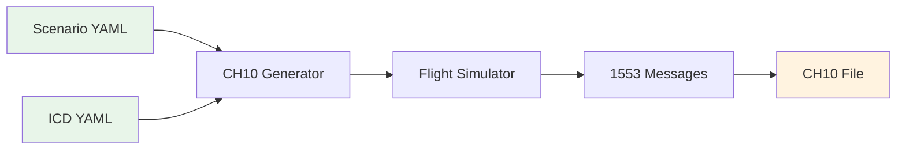

# Quick Start Guide

Get up and running with CH10-1553-FlightGen in 5 minutes!

## Prerequisites

Before you begin, ensure you have:
- **Python 3.10+** installed
- **Windows 10/11** (primary platform)
- **Git** for cloning the repository
- **Git Bash** (recommended terminal for Windows)

## Installation

### Option 1: From Source (Recommended)
```bash
# Clone the repository
git clone https://github.com/yourusername/ch10-1553-flightgen.git
cd ch10-1553-flightgen

# Install dependencies
pip install -r requirements.txt

# Install in development mode
pip install -e .

# Verify installation
python -m ch10gen --version
```

### Option 2: Windows Executable
```bash
# Download the latest release
# https://github.com/yourusername/ch10-1553-flightgen/releases

# Or build it yourself
pyinstaller --onefile --name ch10gen --distpath dist ch10gen/__main__.py

# Run the executable
./dist/ch10gen.exe --help
```

## Your First CH10 File

### Step 1: Generate a Simple Flight
```bash
# Generate a 5-minute demo flight
python -m ch10gen build \
    --scenario scenarios/test_scenario.yaml \
    --icd icd/nav_icd.yaml \
    --out my_first_flight.ch10 \
    --duration 300
```

### Step 2: Validate the Output
```bash
# Check that the file is valid
python -m ch10gen validate my_first_flight.ch10
```

You should see output like:
```
Validation Results:
  File size: 5,200,000 bytes
  Packets: 15,300
  TMATS: [PRESENT]
  Time packets: 300
  1553 packets: 15,000
  1553 messages: 15,000
  Message rate: 50.0 Hz

[SUCCESS] Validation PASSED
File 'my_first_flight.ch10' is valid and ready for use
```

### Step 3: Inspect the Generated Data
```bash
# View message timeline
python -m ch10gen inspect my_first_flight.ch10 --max-messages 10

# Check ICD validity
python -m ch10gen check-icd icd/nav_icd.yaml
```

## Understanding the Data Flow



### What's in a Scenario?
The scenario defines your flight profile:
```yaml
name: "Quick Demo Flight"
duration_s: 300
profile:
  segments:
    - type: climb
      to_altitude_ft: 10000
      duration_s: 120
    - type: cruise
      altitude_ft: 10000
      duration_s: 180
```

### What's in an ICD?
The ICD defines your 1553 messages:
```yaml
bus: A
messages:
  - name: NAVIGATION
    rate_hz: 50
    rt: 10
    tr: BC2RT
    sa: 1
    wc: 8
    words:
      - name: altitude
        src: flight.altitude_ft
        encode: bnr16
```

## Interactive Mode (GUI)

Launch the CH10 Studio application for a visual interface:

```bash
# Launch the GUI
cd ch10-studio
npm run tauri dev

# Or use the installer
./ch10-studio-installer.exe
```


## Common Use Cases

### 1. Testing a CH10 Reader
```bash
# Generate predictable test data
python -m ch10gen build \
    --scenario scenarios/random_test.yaml \
    --icd icd/nav_icd.yaml \
    --out test_data.ch10 \
    --seed 42  # Reproducible output
```

### 2. Simulating Flight Test Data
```bash
# Create realistic flight test data
python -m ch10gen build \
    --scenario scenarios/random_test.yaml \
    --icd icd/nav_icd.yaml \
    --out flight_test.ch10 \
    --duration 3600 \
    --writer pyc10
```

### 3. Stress Testing
```bash
# High-rate message generation
python -m ch10gen build \
    --scenario scenarios/random_test.yaml \
    --icd icd/nav_icd.yaml \
    --out stress_test.ch10 \
    --duration 600 \
    --writer pyc10
```

## Creating Your Own Scenarios

### Simple Climb and Cruise
```yaml
# my_scenario.yaml
name: "My Custom Flight"
duration_s: 600
seed: 123

profile:
  base_altitude_ft: 2000
  segments:
    - type: climb
      to_altitude_ft: 15000
      ias_kt: 250
      duration_s: 300
      
    - type: cruise
      altitude_ft: 15000
      mach: 0.5
      duration_s: 300
```

### Combat Maneuvers
```yaml
# combat_scenario.yaml
name: "Fighter Training"
duration_s: 900

profile:
  segments:
    - type: takeoff
      duration_s: 30
      
    - type: combat_turn
      bank_deg: 60
      g_force: 4.0
      heading_change_deg: 180
      duration_s: 45
      
    - type: vertical_climb
      climb_rate_fpm: 6000
      duration_s: 30
```

## Troubleshooting

### Issue: "Module not found"
```bash
# Ensure you're in the project directory
cd ch10-1553-flightgen

# Reinstall dependencies
pip install -r requirements.txt
```

### Issue: "Invalid YAML"
```bash
# Validate your YAML files
python -m ch10gen check-icd your_icd.yaml
```

### Issue: "Memory error on large files"
```bash
# Use smaller duration for large files
python -m ch10gen build \
    --scenario scenarios/random_test.yaml \
    --icd icd/nav_icd.yaml \
    --out large_file.ch10 \
    --duration 60
```

## Next Steps

Now that you've generated your first CH10 file:

1. **Explore the Examples**: Check out `scenarios/` and `icd/` directories
2. **Read the Documentation**: 
   - [Configuration Guide](CONFIGURATION.md) - Detailed YAML options
   - [Architecture Overview](ARCHITECTURE.md) - How it all works
   - [IRIG-106 Chapter 10 Structure](IRIG_106_CHAPTER_10_STRUCTURE.md) - CH10 file format details
3. **Test the CLI**: Try different scenarios and ICD configurations

## Pro Tips

1. **Use Seeds for Reproducibility**: Always specify `--seed` when you need consistent output
2. **Start Small**: Test with short durations first, then scale up
3. **Monitor Performance**: Use `--verbose` to see detailed progress
4. **Validate Often**: Run `validate` after each generation to catch issues early
5. **Inspect Data**: Use the `inspect` command to view message timeline

## Getting Help

- **Documentation**: Full docs in the `docs/` directory
- **Examples**: Working examples in `scenarios/` and `icd/`
- **Tests**: Test files in `tests/` directory
- **Troubleshooting**: See [Troubleshooting Guide](TROUBLESHOOTING.md)

---

**Congratulations!** You're now ready to generate realistic CH10 files with 1553 flight test data!
