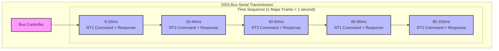
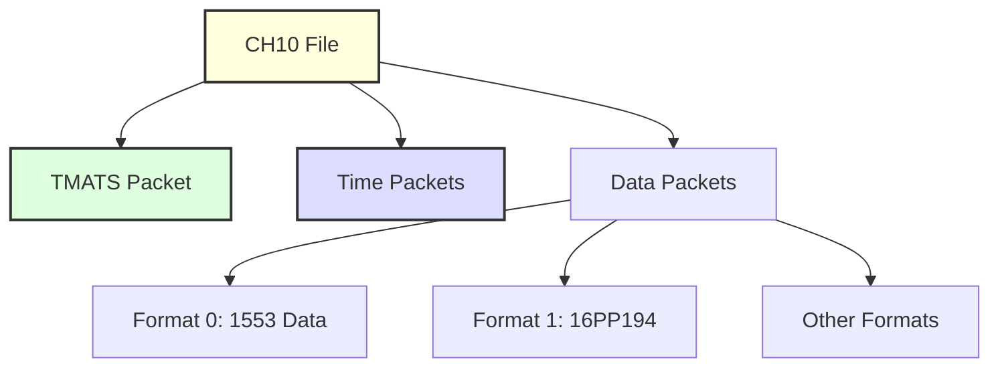
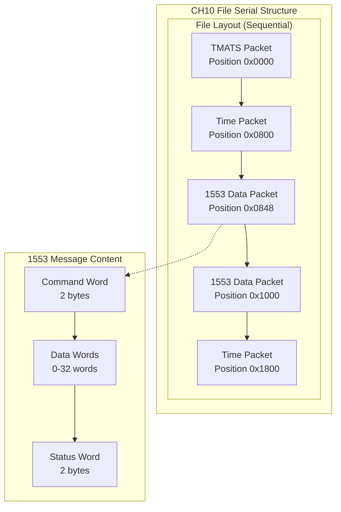
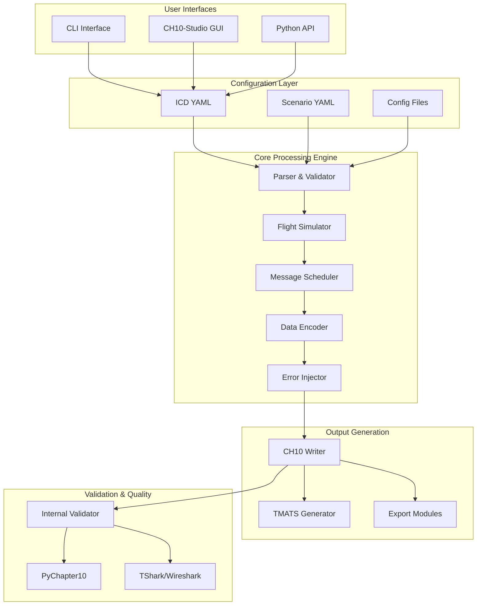
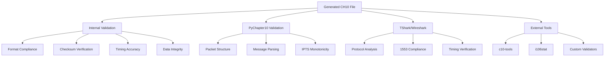
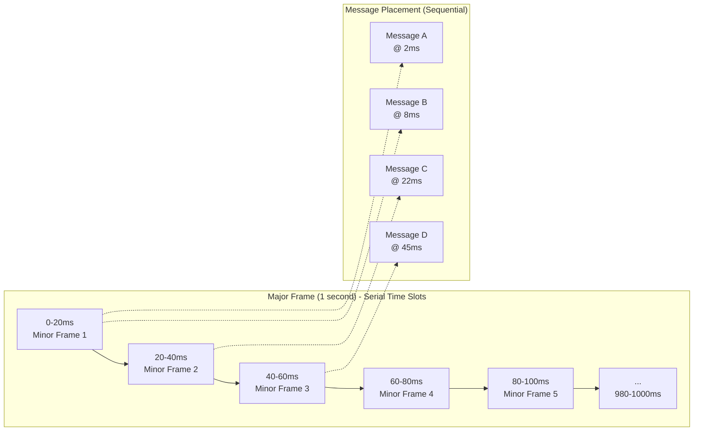
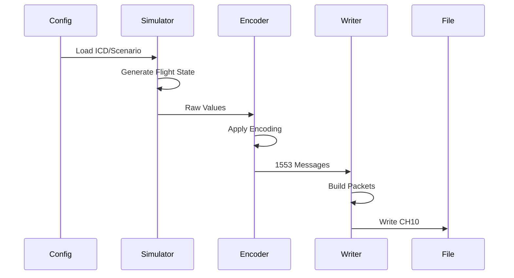
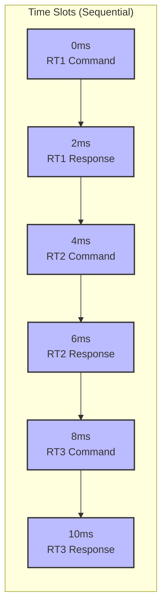

# Level 1: High-Level Overview
## CH10-1553-FlightGen - Technical Foundation

### Project Overview

The CH10-1553-FlightGen is a comprehensive flight test data generation system that creates IRIG-106 Chapter 10 format files containing MIL-STD-1553 bus data. This tool simulates realistic flight test instrumentation data for testing, development, and validation purposes.

**What This Means for Users:**
- Generate realistic flight test data without actual aircraft operations
- Create standards-compliant files that work with existing aerospace analysis tools
- Test systems with known, controlled data patterns and edge cases
- Validate data recording and processing pipelines before flight testing
- Train operators and engineers with realistic scenarios
- Develop and test analysis algorithms with controlled datasets

### Key Standards and Formats

#### MIL-STD-1553
MIL-STD-1553 is a military standard that defines a serial data bus for aircraft. Key characteristics:
- **Dual-redundant** balanced line physical layer
- **Time-division multiplexing**
- **Command/response protocol**
- **1 Mbps data rate**
- **Up to 31 Remote Terminals (RTs)**



#### IRIG-106 Chapter 10
IRIG-106 Chapter 10 defines the standard for recording digital flight data. It specifies:
- **File structure** for recorded data
- **Packet formats** for different data types
- **Time synchronization** methods
- **Data integrity** mechanisms



### CH10 Packet Types

#### TMATS (Telemetry Attributes Transfer Standard)
- **Purpose**: Describes the data contained in the file
- **Format**: ASCII text in key-value pairs
- **Location**: Usually first packet in file
- **Content**: Channel definitions, data sources, encoding information

#### Time Packets
- **Purpose**: Provide time synchronization
- **Types**: 
  - Format 1: IRIG-B time
  - Format 2: GPS time
  - Format 3: RTC time
- **Frequency**: Typically every 1-10 seconds

#### 1553 Data Packets
- **Purpose**: Contains actual 1553 bus messages
- **Format**: IRIG-106 Chapter 10 Format 0 (MIL-STD-1553)
- **Structure**:
  - Packet header (24 bytes)
  - Intra-packet timestamp (8 bytes)
  - Block status (2 bytes)
  - Gap time (2 bytes)
  - 1553 message data (variable)



**Structure Explanation:**
The CH10 packet contains a 1553 message in its Message Data field. The 1553 message itself consists of:
- **Command Word (2 bytes)**: Contains RT address, T/R bit, subaddress, and word count
- **Data Words (0-32 words)**: The actual data payload  
- **Status Word (2 bytes)**: Response status from the remote terminal

This shows how the 1553 message is completely contained within the CH10 packet structure.

### Data Encoding Types

The system supports various encoding methods as defined in Interface Control Documents (ICDs):

| Encoding | Description |
|----------|-------------|
| **u16** | Unsigned 16-bit integer |
| **i16** | Signed 16-bit integer |
| **BNR16** | Binary Number Representation |
| **BCD** | Binary Coded Decimal |
| **float32_split** | IEEE 754 split across 2 words |

### Bitfield Packing

The system supports bitfield packing as specified in Interface Control Documents (ICDs), allowing multiple parameters to be stored in single 16-bit words using mask and shift operations.

**Example**: A single 16-bit word can contain:
- **Bits 0-1**: Status flag (2 bits)
- **Bits 2-7**: Counter value (6 bits) 
- **Bits 8-15**: Main data value (8 bits)

**Why This Matters:**
- **Standards Compliance**: ICD specifications for data layout are followed
- **Efficiency**: Multiple parameters can be packed into a single 16-bit word
- **Data Density**: Information per transmission is maximized
- **Flexibility**: Different message requirements can be accommodated

### System Components



### Configuration Files

#### ICD (Interface Control Document)
Defines the structure and content of 1553 messages:
- Message definitions
- Word layouts
- Encoding specifications
- Data sources
- Transmission rates

#### Scenario
Defines the simulation parameters:
- Flight profile
- Duration
- Initial conditions
- Error injection settings

### Validation Methods

The system provides comprehensive multi-layer validation:



### File Structure Example

A typical CH10 file contains:

```
Position  | Content           | Size
----------|-------------------|----------
0x0000    | TMATS Packet      | ~2KB
0x0800    | Time Packet       | 72 bytes
0x0848    | 1553 Data Packet  | Variable
0x1000    | 1553 Data Packet  | Variable
0x1800    | Time Packet       | 72 bytes
...       | ...               | ...
```

**Serial File Generation:**
- **Sequential Writing**: Packets are written to disk in chronological order
- **Position Dependencies**: Each packet's position depends on previous packets
- **Time Synchronization**: Time packets provide reference points for analysis
- **Data Continuity**: 1553 messages maintain their transmission order in the file

**Why Serial File Structure Matters:**
- **Analysis Tools**: Data in chronological sequence is expected
- **Playback Systems**: Original timing reconstruction is required
- **Debugging**: Sequential access facilitates issue tracing
- **Standards Compliance**: IRIG-106 specifies this sequential structure

### Message Scheduling

Messages are organized into major and minor frames to ensure serial transmission:



**Serial Transmission Structure:**
- **Major Frame**: 1 second cycle that repeats continuously
- **Minor Frames**: 50 sequential 20ms time slots within each major frame
- **Message Placement**: Each message gets a specific time slot to avoid bus conflicts
- **Sequential Access**: Messages transmit one after another, never simultaneously

**Why This Matters:**
- **1553 Bus**: Only one message can transmit at a time (serial constraint)
- **Timing Accuracy**: Each message has a precise transmission window
- **Bus Utilization**: Efficient scheduling maximizes data throughput
- **Predictability**: Analysis tools can rely on consistent timing patterns

### Data Flow



The data generation process follows a clear sequence. Configuration files define what to generate and how to simulate it. The flight simulator creates realistic aircraft dynamics, which are then encoded into 1553 message format. Finally, the CH10 writer assembles these messages into properly formatted packets and writes them to disk.

### Serial Data Transmission

Since 1553 is a serial bus and CH10 files are written sequentially, understanding the serial nature is crucial:

#### 1553 Bus Serial Transmission



**Key Points:**
- Only one message transmits at a time on the bus
- Messages are scheduled sequentially to avoid conflicts
- Each message takes a specific time slot
- The bus controller manages this sequential access

#### CH10 File Serial Writing

The file is written sequentially with packets at specific positions:
- **TMATS Packet**: File metadata at position 0x0000
- **Time Packets**: Synchronization every 2KB (0x0800, 0x1800, etc.)
- **1553 Data Packets**: Actual message data between time packets
- **Sequential Order**: Each packet follows the previous one in the file

**Key Points:**
- Packets are written sequentially to disk
- Each packet has a fixed position in the file
- Time packets provide synchronization points
- Data packets contain the actual 1553 messages in chronological order

#### Why Serial Matters

**1553 Bus Constraints:**
- Physical limitation: Only one message at a time
- Timing requirements: Messages must fit in their allocated slots
- Bus utilization: Efficient scheduling maximizes data throughput

**CH10 File Constraints:**
- Sequential access: Files are read from beginning to end
- Time synchronization: Each packet needs accurate timing
- Data integrity: Sequential writing ensures proper packet ordering

### Common Use Cases

1. **Testing Analysis Software**: Generate known data patterns to verify analysis tools
2. **Training**: Create realistic data without actual flight operations
3. **Development**: Build and test ground systems before hardware availability
4. **Validation**: Verify data recording systems work correctly
5. **Research**: Experiment with new data processing algorithms

**Real-World Scenarios:**
- **Ground Testing**: Data analysis software can be verified before flight
- **System Integration**: Different components can be tested with 1553 data
- **Training Programs**: Realistic scenarios can be created for operators and engineers
- **Compliance Testing**: Systems can be ensured to meet IRIG-106 standards
- **Debugging**: Specific data patterns can be generated to reproduce issues

### How This Was Built

#### Tools That Were Leveraged

The system leverages proven, industry-standard tools rather than reinventing functionality:

**PyChapter10**: A mature Python library for reading and writing IRIG-106 Chapter 10 files. Used for validation and format compliance verification.

**Wireshark/TShark**: The industry standard for protocol analysis. Serves as the primary validation method - if TShark can read the generated files, standards-compliant output is confirmed.

**Click**: A robust CLI framework that provides the structure and help system expected in aerospace tools.

**Tauri**: A modern framework for building native desktop applications (CH10-Studio) without the overhead of web technologies.

**NumPy/SciPy**: For efficient numerical computations in flight simulation and data encoding.

**PyInstaller**: For creating standalone executables and portable distributions.

#### Development Approach

The system started simple and evolved based on real needs:

1. **Started with basics**: Simple 1553 message generation
2. **Added configuration**: YAML files for flexibility
3. **Built simulation**: Realistic flight dynamics and sensor data
4. **Implemented bitfields**: Efficient word packing as specified in ICDs
5. **Added validation**: Multiple layers of verification

Each step was driven by understanding what aerospace engineers actually need, not by assumptions about what might be wanted. The system was built to solve immediate problems, then refined based on usage and feedback.

#### Why This Approach Works

**Standards Compliance**: By building on existing tools and following established standards, the output works with existing analysis systems.

**Validation**: Having TShark as a second opinion means files are not just generated to look correct internally.

**Flexibility**: YAML configuration means the tool can be adapted to specific needs without code changes.

**Performance**: Native desktop application with efficient Python backend means real-world data volumes can be handled.

### Getting Started with This Tool

**What Is Needed:**
- Python 3.8+ (for the CLI version) or Windows executable
- YAML configuration files (ICD and scenario)
- Basic understanding of 1553 message structure
- Optional: Wireshark for validation

**Quick Start:**
1. **Define Data**: Create an ICD file describing 1553 messages
2. **Set Scenario**: Configure flight parameters and duration
3. **Generate Data**: Run the tool to create CH10 files
4. **Validate Output**: Use TShark or PyChapter10 to verify files

**Available Interfaces:**
- **CLI**: Command-line interface for automation and scripting
- **CH10-Studio**: Graphical user interface for interactive use
- **Python API**: Programmatic access for integration
- **Portable**: Standalone executables for deployment

**Example Use Case:**
- **Goal**: Test 1553 analysis software
- **Input**: ICD defining navigation and engine data messages
- **Output**: CH10 file with 1 hour of realistic flight data
- **Validation**: Open in Wireshark to verify protocol compliance

**Why This Approach Works:**
- **Standards-Based**: Output works with existing aerospace tools
- **Configurable**: Can be adapted to specific message definitions
- **Validated**: Multiple validation layers ensure correctness
- **Scalable**: Data volumes needed for testing can be generated
- **Portable**: Standalone executables for easy deployment


