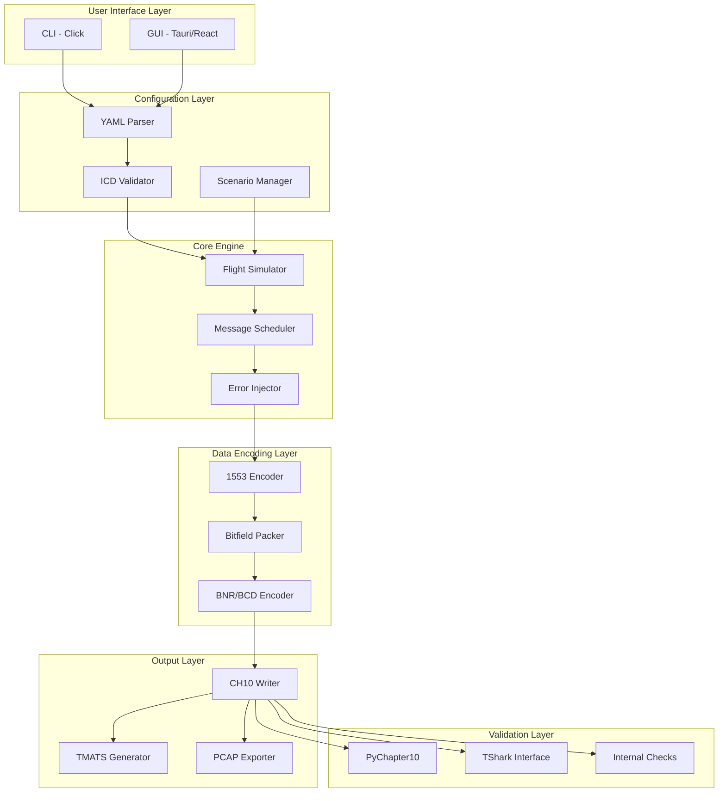
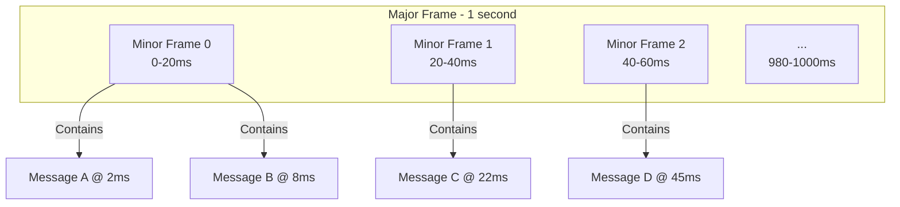

# Level 2: Technical Overview
## CH10 Generator - System Architecture and Implementation

### System Purpose and Design Philosophy

The CH10 Generator is engineered to solve a critical problem in aerospace testing: the need for realistic, standards-compliant flight test data without the cost and risk of actual flights. Our design philosophy centers on:

1. **Accuracy**: Data must match what real systems produce
2. **Flexibility**: Features accessible through configuration files
3. **Standards Compliance**: Strict adherence to IRIG-106 and MIL-STD-1553
4. **Validation at Every Step**: Built-in checks and external tool compatibility
5. **Performance at Scale**: Handle real-world data rates and file sizes

**Why This Matters:**
- **Cost Savings**: Testing can be performed with simulated data instead of expensive flight hours
- **Risk Reduction**: Systems can be validated on the ground before airborne testing
- **Standards Compliance**: Data can be ensured to meet industry requirements
- **Scalability**: Gigabytes of data can be generated for testing
- **Reproducibility**: Identical test scenarios can be created for consistent validation

### Technical Architecture



### Core Components Explained

#### 1. Interface Control Document (ICD) System

The ICD defines what data to generate through structured configuration files. Each ICD specifies:
- Message names and their transmission rates (e.g., 50 Hz for navigation data)
- Remote Terminal addresses and subaddresses for bus routing
- Word definitions including encoding types and data sources
- Scaling factors and offsets for value conversion

The system uses YAML format for ICDs because it's human-readable, supports comments for documentation, and integrates well with version control systems. The ICD structure mirrors how aerospace engineers typically document message definitions, making it intuitive for domain experts.

#### 2. Flight Profile Simulation

The flight simulator generates realistic aircraft dynamics and sensor data. It models the complete flight envelope through distinct phases:


The simulation includes:
- **Physics modeling**: Altitude changes, airspeed variations, attitude dynamics
- **Flight segments**: Takeoff, climb, cruise, descent, landing phases
- **Sensor characteristics**: GPS position with noise, INS drift over time, altimeter variations
- **Aircraft constraints**: Realistic acceleration limits, turn rates, climb/descent rates
- **Environmental factors**: Wind effects, atmospheric conditions

#### 3. Message Scheduling System

The scheduler organizes 1553 messages into a deterministic timing structure using major and minor frames:



The scheduling process follows these principles:
- **Rate-based distribution**: Messages are placed based on their required transmission rates
- **Conflict prevention**: No two messages can transmit simultaneously on the same bus
- **Bus utilization optimization**: Messages are packed efficiently while maintaining timing requirements
- **Deterministic timing**: Same schedule repeats every major frame for predictability
- **Jitter simulation**: Optional timing variations to simulate real-world conditions

#### 4. Bitfield Packing

The system supports bitfield packing as specified in ICDs, allowing multiple parameters to be stored in single 16-bit words.

**Example**: A single 16-bit word can contain:
- **Bit 0**: Power status flag (1 bit)
- **Bit 1**: GPS valid indicator (1 bit)
- **Bits 2-11**: Temperature value (10 bits)
- **Bits 12-15**: Reserved for future use (4 bits)

Bitfield packing characteristics:
- **Mask specification**: Defines which bits are used for each field
- **Shift positioning**: Determines where in the word the field is placed
- **Value validation**: Ensures values fit within allocated bits
- **Overlap detection**: Prevents multiple fields from using the same bits
- **Scaling support**: Values can be scaled before packing
- **Word indexing**: Multiple fields can target the same word position

#### 5. CH10 File Generation

Creates standard-compliant output:

```
CH10 File Structure:
├── File Header
├── TMATS Packet (metadata)
├── Time Packet (synchronization)
├── Data Packets
│   ├── 1553 Channel 1
│   ├── 1553 Channel 2
│   └── ...
└── EOF
```

**Packet Format:**
- Sync pattern: 0xEB25
- Channel ID: Identifies data source
- Packet length: Size in bytes
- Data type: 1553, analog, video, etc.
- Time stamp: IRIG-106 format
- Payload: Actual message data

### Data Flow Pipeline

```
1. Configuration Loading
   YAML Files → Parser → Validation → Internal Models

2. Simulation Initialization
   Scenario → Flight Profile → Initial State

3. Time Step Processing (per millisecond)
   Current Time → Flight Dynamics → Sensor Values
                → Message Schedule → Messages to Send

4. Message Generation
   Template + Values → Encoding → 16-bit Words → 1553 Format

5. Packet Assembly
   Messages → CH10 Packets → Buffering → File Writing

6. Validation
   Generated File → Reader → Verification → Report
```

### Performance Optimizations

#### Memory Management
- Streaming writes (no full file in memory)
- Circular buffers for packet assembly
- Lazy evaluation of flight dynamics
- Efficient numpy arrays for calculations

#### Speed Optimizations
- Pre-calculated message templates
- Lookup tables for common encodings
- Batch I/O operations
- Optional parallel processing

#### Scalability Features
- Configurable packet sizes
- Adjustable buffer sizes
- Chunked generation for long recordings
- Incremental file writing

### Validation and Testing Strategy

#### Multi-Layer Validation

1. **Input Validation**
   - YAML schema checking
   - ICD constraint validation
   - Scenario feasibility checks

2. **Generation Validation**
   - Message rate verification
   - Timing accuracy checks
   - Encoding correctness

3. **Output Validation**
   - CH10 format compliance
   - TMATS correctness
   - External tool verification (TShark)

#### Test Coverage

```
Test Categories:
├── Unit Tests (150+)
│   ├── Encoding functions
│   ├── Bitfield packing
│   ├── ICD parsing
│   └── Flight dynamics
├── Integration Tests (75+)
│   ├── End-to-end generation
│   ├── File format validation
│   └── Tool compatibility
├── Performance Tests (25+)
│   ├── Large file generation
│   ├── Memory usage
│   └── Generation speed
└── Validation Tests (25+)
    ├── TShark compatibility
    ├── PyChapter10 reading
    └── PCAP export
```

### Error Handling Philosophy

#### Fail-Fast Validation
The system validates all inputs before processing:
- RT addresses must be within 0-31 range
- Subaddresses must be within 0-31 range  
- Word counts must be between 1-32
- All errors are collected and reported together
- Processing stops immediately if validation fails

#### Graceful Degradation
- Missing optional fields use defaults
- Invalid sensor readings marked but don't stop generation
- Warnings for non-critical issues

#### Detailed Error Messages
```
ERROR: Bitfield overlap in message NAV_DATA, word 0
  Field 'altitude' uses bits 0-9
  Field 'airspeed' uses bits 8-15
  Overlapping bits: 8-9
  
Suggestion: Adjust mask or shift values to prevent overlap
```

### Integration Capabilities

#### External Tools
- **Wireshark/TShark**: Industry-standard packet analysis for validation
- **PyChapter10**: Python library for CH10 file reading and validation

#### Export Formats
- **CH10**: Primary IRIG-106 Chapter 10 output format
- **PCAP**: Network analysis format for protocol analyzers
- **JSON**: Metadata and configuration export

#### API Design

The system provides two levels of API access:

**High-level API**: Simple function calls for common operations
- Load ICD and scenario files
- Generate complete CH10 files with single command
- Automatic scheduling and encoding
- Built-in validation and error handling

**Low-level API**: Component access for custom integration
- Direct access to parser, simulator, and writer components
- Step-by-step control over generation process
- Custom message scheduling options
- Integration with existing systems

### Configuration Management

#### Hierarchical Configuration
```
Project/
├── icd/
│   ├── base_icd.yaml      # Common definitions
│   ├── nav_icd.yaml       # Navigation messages
│   └── engine_icd.yaml    # Engine messages
├── scenarios/
│   ├── standard_flight.yaml
│   ├── emergency_test.yaml
│   └── endurance_test.yaml
└── configs/
    ├── development.yaml    # Dev settings
    └── production.yaml     # Production settings
```

#### Environment-Specific Settings

Different configurations can be used for different environments:

**Development Configuration**:
- Debug mode enabled for detailed output
- Strict validation to catch all issues
- Verbose output format for troubleshooting
- Smaller packet sizes for easier debugging

**Production Configuration**:
- Debug mode disabled for performance
- Normal validation for efficiency
- Compact output format to save space
- Larger packet sizes for optimal throughput

### Tools and Dependencies We've Leveraged

#### Why We Chose These Tools

**PyChapter10**: This was the starting point - an existing Python library that could read CH10 files. The wheel was not reinvented for file format parsing, so the system was built on top of it. It handles the complex IRIG-106 Chapter 10 format details while the focus is on generating the data.

**Wireshark/TShark**: This tool is used as the primary validation method because it's the industry standard for protocol analysis. Having TShark successfully decode the generated files provides confidence that standards-compliant output is being produced. It's like having a second opinion from a trusted expert.

**Click (CLI Framework)**: A command-line interface was needed that aerospace engineers would feel comfortable using. Click provides the structure and help system that makes the tool feel like other aerospace tools.

**Tauri (GUI Framework)**: For the graphical interface, something was needed that could create native desktop applications without the overhead of Electron. Tauri provides the performance and native feel that users expect.

#### Development Journey

The system started with a simple Python script that could generate basic 1553 messages. As more was learned about the standards and user needs, the architecture evolved:

1. **Phase 1**: Basic message generation with hardcoded values
2. **Phase 2**: YAML configuration for flexibility
3. **Phase 3**: Flight simulation for realistic data
4. **Phase 4**: Bitfield packing for efficient word usage
5. **Phase 5**: Validation with external tools

Each phase was driven by real user feedback and discoveries about what aerospace engineers actually need. Everything was not built at once - the system was built to solve immediate problems, then refined based on usage.

#### Fallback Methods and Validation

We don't rely on just one tool to validate our output:

**Primary Validation**: TShark/Wireshark - because it's the industry standard
**Secondary Validation**: PyChapter10 - because it's specifically designed for CH10 files
**Internal Validation**: Internal checks for format compliance and data integrity

If TShark can't read the generated files, a serious problem is indicated. If PyChapter10 can't read them, the CH10 format is incorrect. If internal checks fail, the logic is flawed. This multi-layered approach catches different types of errors.

#### What Was Learned Along the Way

**Standards Matter**: IRIG-106 and MIL-STD-1553 are complex, but they're designed this way for good reasons. The standards were respected rather than worked around.

**Real Data is Messy**: Flight data has noise, timing variations, and edge cases. The simulation had to account for these realities, not just generate perfect theoretical data.

**Validation is Critical**: Without external validation tools, files would just be generated to look correct internally. Having TShark as a second opinion is invaluable.

**Performance Matters**: Aerospace engineers work with large datasets. The tool needs to generate gigabytes of data quickly and efficiently.

**How This Benefits Users:**
- **Reliable Output**: The tool follows standards exactly, so analysis tools will work
- **Realistic Data**: Simulated data includes real-world imperfections and timing variations
- **Trusted Validation**: Multiple validation layers ensure generated files are correct
- **Scalable**: Data volumes needed for testing can be handled

### Security Considerations

#### Input Sanitization
- YAML safe loading (no code execution)
- Path traversal prevention
- Size limits on input files
- Rate limiting for API calls

#### Output Protection
- Configurable file permissions
- Optional encryption support
- Audit logging capability
- Secure credential storage


### Monitoring and Observability

#### Metrics Collected
- Generation time per GB
- Memory usage patterns
- Error rates by type
- Validation success rates
- File size distributions

#### Logging Strategy
```python
logger.info(f"Starting generation: {scenario_name}")
logger.debug(f"Message rate: {rate_hz} Hz")
logger.warning(f"High bus utilization: {utilization}%")
logger.error(f"Encoding failed: {error}")
```

#### Health Checks
- Version compatibility
- Dependency availability
- File system access
- Memory availability
- CPU usage


---

*The CH10 Generator integrates aerospace domain knowledge with software engineering practices to create a functional data generation system.*
