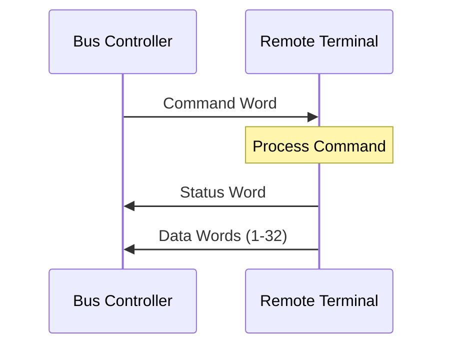
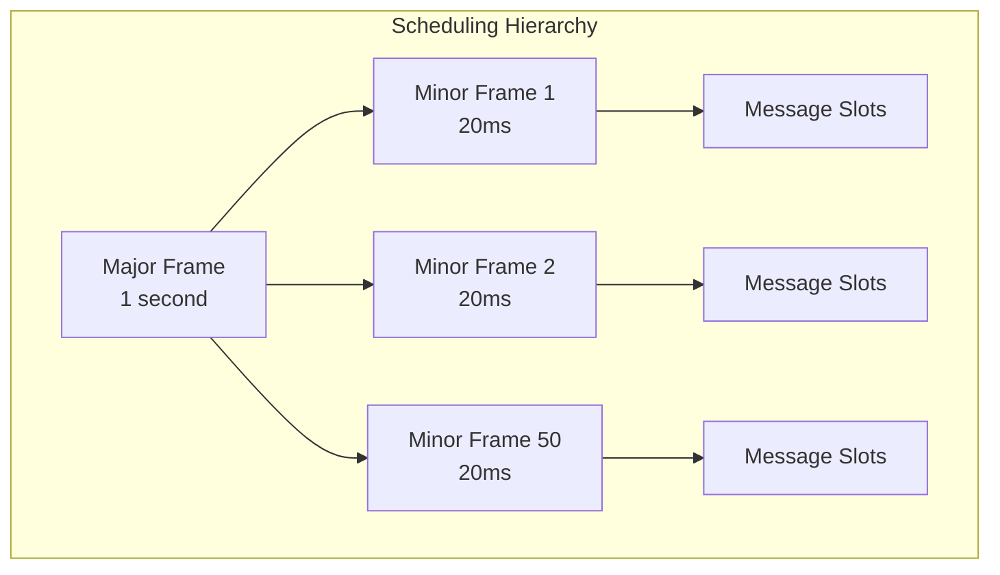
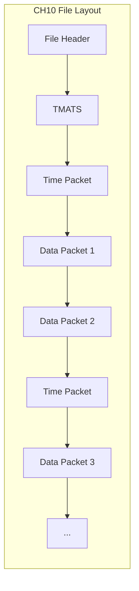
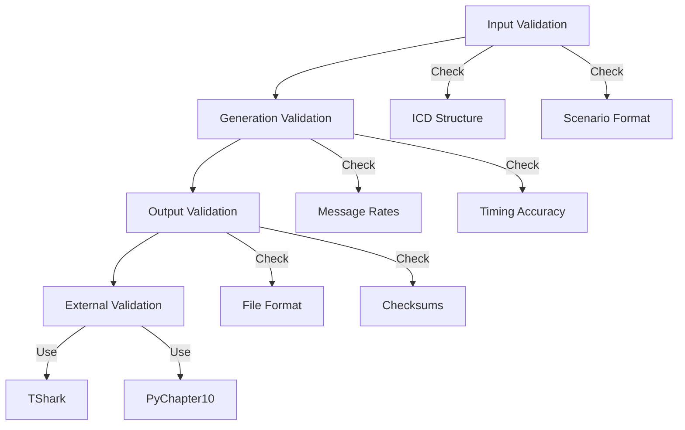

# Level 3: Implementation Details
## CH10 Generator - Complete Technical Description

### The Problem Space

#### Flight Test Data Challenges

Flight testing generates massive amounts of data that must be recorded, processed, and analyzed. The data comes from hundreds of sensors and avionics systems, all operating at different rates and using different encoding schemes. Test engineers need this data in standardized formats for analysis, but obtaining real flight data involves:

- Operating actual aircraft with full instrumentation
- Risk to equipment and personnel during test maneuvers
- Limited ability to repeat exact conditions
- High operational costs for each test flight
- Long lead times for test preparation

The CH10 Generator addresses these challenges by creating synthetic data that matches what real systems produce, allowing development and testing of analysis tools without actual flight operations.

**What This Means for Users:**
- **Immediate Testing**: Systems can be validated today, not after flight scheduling
- **Risk-Free Development**: Edge cases and failure modes can be tested safely
- **Cost Control**: Development and validation can proceed without expensive flight hours
- **Repeatable Scenarios**: Identical test conditions can be created for consistent validation
- **Standards Compliance**: Tools can be ensured to work with industry-standard formats

### MIL-STD-1553 Protocol Details

#### Message Structure

The 1553 protocol uses a command/response architecture where a Bus Controller (BC) orchestrates all communication with Remote Terminals (RTs). Each message transaction consists of three parts:

#### Word Formats

Each 16-bit word in 1553 has specific bit allocations:

**Command Word Structure**:
- Bits 0-4: Word Count or Mode Code
- Bits 5-9: Subaddress
- Bit 10: Transmit/Receive bit
- Bits 11-15: RT Address

**Status Word Structure**:
- Bits 0-4: Reserved
- Bit 5: Instrumentation bit
- Bit 6: Service Request
- Bit 7: Reserved
- Bit 8: Broadcast Command Received
- Bit 9: Busy
- Bit 10: Subsystem Flag
- Bit 11: Dynamic Bus Control Acceptance
- Bit 12: Terminal Flag
- Bits 13-15: RT Address echo

#### Special Addresses and Modes

The 1553 standard defines special addresses with specific meanings:
- RT Address 31: Broadcast address (all RTs receive)
- Subaddress 0: Mode code commands
- Subaddress 31: Mode code commands
- Word Count 0: Actually means 32 words (historical convention)

### Data Encoding Methods

#### Binary Number Representation (BNR)

BNR encoding represents fractional numbers in fixed-point format. The encoding process involves:

1. **Range determination**: Define the minimum and maximum values
2. **Scaling calculation**: Determine bits needed for required resolution
3. **Value conversion**: Scale the floating-point value to integer range
4. **Two's complement**: Handle negative values using two's complement

For angles, BNR typically uses:
- Full 16 bits for 360-degree range
- Resolution of 360/65536 = 0.0055 degrees per bit
- Automatic wraparound for values outside -180 to +180

#### Binary Coded Decimal (BCD)

BCD encoding stores each decimal digit in 4 bits:
- Each nibble (4 bits) represents one decimal digit (0-9)
- 16-bit word can store 4 decimal digits
- Used for frequencies, identifiers, and display values
- No arithmetic operations performed on BCD values

#### Float32 Split Encoding

IEEE 754 single-precision floats are split across two 16-bit words:
- First word: Sign bit, exponent, and upper mantissa
- Second word: Lower mantissa bits
- Maintains full 32-bit precision
- Used for high-precision measurements like GPS coordinates

### Bitfield Packing Support

#### Standard Practice

Bitfield packing is a common technique used in Interface Control Documents (ICDs) to efficiently utilize 16-bit word space. The system implements this standard approach to support ICD specifications.

**Example**: A 16-bit word can contain multiple fields as specified in the ICD:
- **Bits 0-2**: Status value (3 bits)
- **Bits 3-7**: Counter value (5 bits)
- **Bits 8-15**: Main data value (8 bits)

#### Validation Rules

The system enforces standard validation rules for bitfield packing:

1. **Bit allocation**: Total bits used cannot exceed 16
2. **Overlap prevention**: No two fields can use the same bit positions
3. **Value range**: Values must fit within allocated bits
4. **Alignment**: Fields must align on bit boundaries
5. **Encoding restrictions**: BNR and float32_split cannot use bitfields

### Flight Dynamics Simulation

#### Physics Model

The flight simulator implements a simplified 6-degree-of-freedom model:

**Translational dynamics**:
- Forward/backward motion (X-axis)
- Left/right motion (Y-axis)  
- Up/down motion (Z-axis)

**Rotational dynamics**:
- Pitch (rotation about Y-axis)
- Roll (rotation about X-axis)
- Yaw (rotation about Z-axis)

#### Sensor Modeling

Each sensor type has characteristic errors and noise:

**GPS Sensors**:
- Position noise: Gaussian distribution, 1-3 meter standard deviation
- Update rate: Typically 1-10 Hz
- Occasional dropouts during maneuvers

**Inertial Navigation System (INS)**:
- Drift accumulation over time
- Higher accuracy than GPS short-term
- Requires periodic GPS updates for correction

**Air Data Sensors**:
- Altitude: Pressure-based with temperature compensation
- Airspeed: Pitot-static system simulation
- Angle of attack: Vane position with aerodynamic effects

### Message Scheduling Algorithm

#### Frame Structure

The scheduling system organizes messages into a hierarchical frame structure:

#### Rate Monotonic Scheduling

Messages are scheduled using rate monotonic principles:
- Higher frequency messages get higher priority
- Messages scheduled at their exact rate when possible
- Lower priority messages fill remaining slots
- Bus utilization monitored to prevent overload

#### Timing Precision

The system maintains microsecond-level timing precision:
- Each message has an exact transmission time
- Gap times between messages are calculated
- Jitter can be added to simulate real-world variations
- Time synchronization maintained throughout file

### IRIG-106 Chapter 10 Format

#### File Structure

CH10 files follow a specific structure:

#### Packet Headers

Each packet contains a standard header with:
- Sync pattern (0xEB25) for packet boundary detection
- Channel ID identifying the data source
- Packet length in bytes
- Data length (payload size)
- Timestamp in IRIG format
- Sequence number for ordering
- Data type identifier

#### TMATS Structure

TMATS (Telemetry Attributes Transfer Standard) uses a hierarchical key-value format:
- G-group: General information about the recording
- B-group: Bus/channel information
- M-group: Message definitions
- R-group: Recording specific data

Each entry follows the pattern: GROUP\KEY:VALUE;

### Validation Framework

#### Multi-Stage Validation

The validation process occurs at multiple stages:

#### Error Detection

The system detects various error conditions:
- **Format errors**: Invalid packet structure, bad sync patterns
- **Timing errors**: Messages outside expected windows
- **Data errors**: Values outside valid ranges
- **Protocol errors**: Invalid RT/SA combinations
- **Encoding errors**: Values that don't fit specified encoding

### Performance Optimization

#### Memory Management

The system uses several techniques to manage memory efficiently:
- Streaming writes prevent loading entire file in memory
- Circular buffers for packet assembly
- Reuse of message templates
- Garbage collection hints at appropriate points

#### I/O Optimization

File writing is optimized through:
- Buffered I/O with configurable buffer sizes
- Batch writes to reduce system calls
- Optional memory-mapped files for large datasets
- Asynchronous I/O where supported

#### Computational Efficiency

Processing is optimized via:
- Lookup tables for common calculations
- Vectorized operations for bulk processing
- Caching of frequently used values
- Lazy evaluation of expensive computations

### Error Injection Capabilities

#### Error Types

The system can inject various error types for testing:

**Bit Errors**: Random bit flips simulating electromagnetic interference
**Dropouts**: Missing messages simulating connection issues
**Timing Variations**: Jitter and drift in message timing
**Protocol Violations**: Invalid command/status words
**Data Corruption**: Incorrect values or encodings

#### Error Patterns

Errors can follow different patterns:
- Random distribution with configurable probability
- Burst errors simulating temporary interference
- Systematic errors at specific times or conditions
- Gradual degradation over time

### Integration Interfaces

#### File Format Exports

The system exports to multiple formats:
- **CH10**: Primary IRIG-106 format
- **PCAP**: For network protocol analyzers
- **JSON**: Structured data for web applications
- **CSV**: Simplified tabular format
- **HDF5**: Scientific data format (optional)

#### Tool Compatibility

Generated files work with standard tools:
- Wireshark/TShark for protocol analysis
- MATLAB for scientific computing
- Python/NumPy for data science
- C/C++ readers for embedded systems

### Configuration Philosophy

#### YAML Structure

Configuration files use YAML for several reasons:
- Human readable without special tools
- Supports comments for documentation
- Hierarchical structure matches data relationships
- Wide tool support across languages
- Version control friendly with text diffs

#### Validation Strategy

All configuration undergoes validation:
- Schema validation ensures structure
- Semantic validation checks relationships
- Range validation for numeric values
- Dependency validation between fields
- Warning generation for suspicious but valid configurations

### Summary

The CH10 Generator implements a complete flight test data generation system that:

- **Follows Standards**: Strict adherence to IRIG-106 and MIL-STD-1553
- **Models Reality**: Physics-based simulation with sensor characteristics
- **Ensures Accuracy**: Multi-stage validation and verification
- **Optimizes Performance**: Efficient memory and I/O management
- **Provides Flexibility**: Extensive configuration options
- **Supports Testing**: Error injection capabilities

The implementation balances accuracy, performance, and usability to create a practical tool for flight test data generation.

### How to Leverage This Tool

**For System Developers:**
- Test data can be generated during development to catch issues early
- Specific test scenarios can be created for edge cases and failure modes
- Data processing pipelines can be validated before flight testing
- System performance can be tested with realistic data volumes

**For Test Engineers:**
- Baseline data sets can be created for system validation
- Known data patterns can be generated for calibration and verification
- Analysis tools can be tested with controlled, repeatable scenarios
- Data recording systems can be validated in the lab

**For Training and Education:**
- Realistic scenarios can be created for operator training
- System behavior can be demonstrated under various conditions
- Data analysis techniques can be taught with known data sets
- How different encoding methods affect data interpretation can be shown

**For Compliance and Certification:**
- Systems can be ensured to meet IRIG-106 standards
- Data formats can be validated for regulatory requirements
- Interoperability with standard analysis tools can be tested
- System capabilities can be demonstrated for certification authorities
